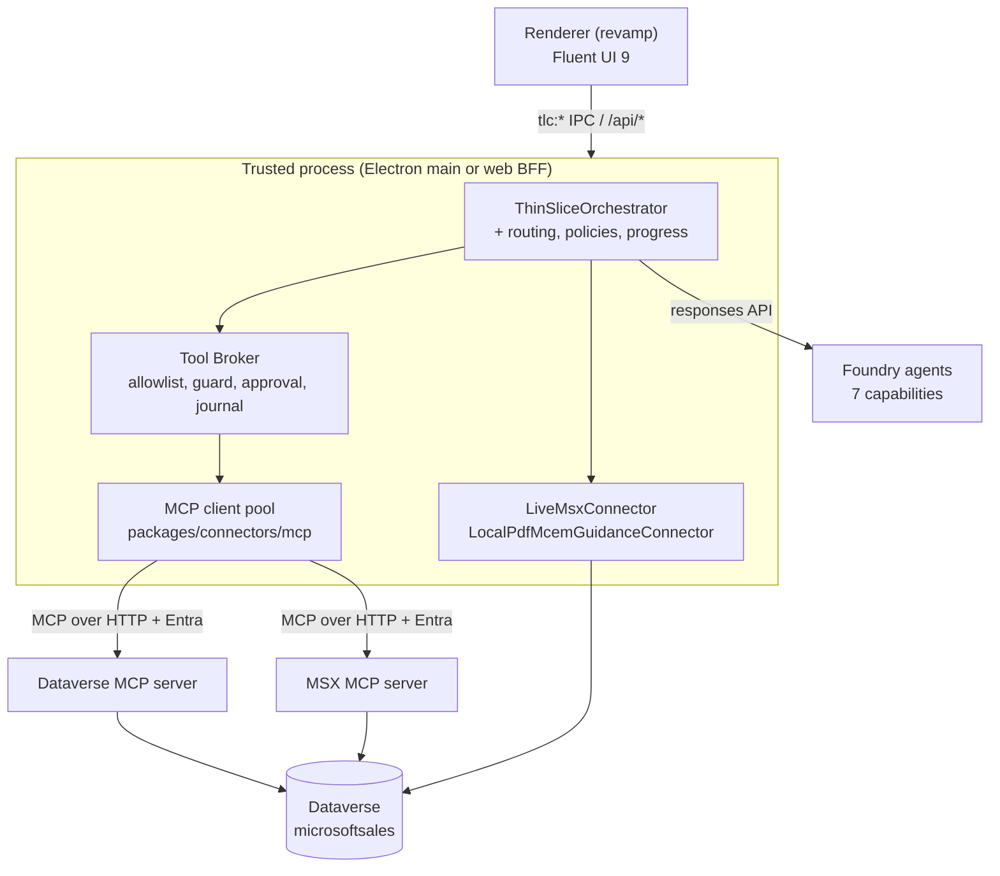
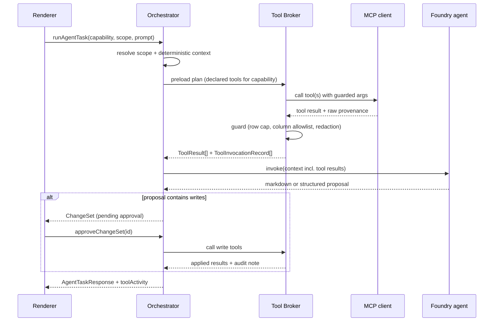

# Dataverse and MSX MCP Connectors: Architecture, Agent, and Experience Plan

| Field | Value |
| --- | --- |
| Status | Draft for review |
| Version | 0.1 |
| Type | Planning only, no implementation |
| Scope | MCP connectors, agent model, workflow catalog, UI surfaces |
| Related | `docs/PRD.md`, `docs/Folder-structure.md`, `docs/decisions/0001-electron-mvp.md`, `docs/decisions/0002-local-orchestrator-foundry-agents.md`, `docs/decisions/0003-hosted-web-bff.md` |

Planning document. No implementation is proposed in this revision; every code path, schema, and
surface described here is a design target for review and sequencing.

## 1. Purpose

This plan answers four questions raised for the next phase of TLC MultiAgent Assist:

1. How to add Model Context Protocol (MCP) connectors for **Dataverse** (broad ASK and query
   coverage) and **MSX** (narrow, seller-shaped task coverage).
2. Whether the current four agents are sufficient once those connectors exist, and if not, which
   agents to add.
3. Which additional account, opportunity, and pipeline workflows become possible.
4. How to expose all of it in the desktop and web experience so interaction stays crisp and fluid.

The document also specifies the internal schemas that must be held in the repository (configuration,
policy, provenance, caching, contracts) and the target UI layout.

## 2. Current State

### 2.1 What exists today

| Layer | Location | Summary |
| --- | --- | --- |
| Contracts | `packages/common/contracts/index.ts` | Zod contracts at `contractVersion = '1.0'`. `sourceHealthSchema.source` is fixed to `msx \| mcem \| seismic \| linkedin`; `evidenceSchema.source` is fixed to `msx \| mcem`. |
| Orchestrator | `packages/orchestrator/index.ts` | `ThinSliceOrchestrator` with `listAccounts`, `listOpportunities`, `listMilestones`, `updateMilestone`, `updateOpportunity`, `transitionOpportunityStage`, `runMcemCoach`, `runAgentTask`. The `routing/`, `workflows/`, `policies/`, `context/`, `progress/` folders are empty placeholders. |
| Agents | `packages/agents/{account-pulse,mcem-coach,pursuit-executive,risk-solution-play}` | Prompt-only Foundry agents (`gpt-5.4-1`). Manifests carry `definition.instructions` that must stay byte-identical to `prompts/instructions.md`. No tools, no function calling, no agent-to-agent calls. |
| Connectors | `packages/connectors/{msx,sharepoint,foundry,common}` | `LiveMsxConnector` calls the Dataverse Web API directly at `https://microsoftsales.crm.dynamics.com/api/data/v9.2/`. `seismic/` and `linkedin/` are empty. |
| Desktop shell | `apps/desktop/electron/{main,preload}` | 14 `tlc:*` IPC channels exposed through `contextBridge`; tokens never leave the main process. |
| Web shell | `apps/web/src/app.ts` | Same operations over same-origin `/api/*` routes, request-scoped connectors. |
| Renderer | `apps/desktop/renderer-revamp/src/App.tsx` (1033 lines) | Single-file React 19 + Fluent UI 9 app: command bar, icon rail, Accounts blade, Opportunities blade, center workbench (`msx` / `guidance` / `stages` tabs), Next-best-actions blade, mobile nav below 900px. |

### 2.2 The two constraints that shape this plan

**MSX is already Dataverse.** `packages/connectors/msx/live.ts:18` targets the Dynamics 365 Web API
for the `microsoftsales` organization, and the MSX token scope in
`config/foundry.environment.default.json` is `https://microsoftsales.crm.dynamics.com/.default`.
Adding "Dataverse MCP" therefore does **not** add a new system of record. It adds a new *access
modality*: schema-discoverable, model-driven, natural-language-shaped access to entities the current
hand-written connector never queries (contacts, activities, competitors, products, territory,
forecast, engagements, partner records).

**Every response today is scoped to one opportunity.** `agentTaskRequestSchema` requires both
`accountId` and `opportunityId`, `runAgentTask` resolves exactly one `OpportunityContext`, and the
guidance UI is only reachable after an opportunity is selected (`App.tsx:818-891`). Portfolio and
pipeline questions are structurally impossible in the current contract. This is the single largest
capability gap and it drives both the new-agent recommendation and the UI changes.

## 3. Why Two MCP Servers

The two servers are complementary, not redundant, and should be modelled as different trust and
latency tiers.

| Dimension | Dataverse MCP | MSX MCP |
| --- | --- | --- |
| Intent | Broad, open-ended ASKs and exploration | Narrow, high-frequency seller tasks |
| Tool shape | Generic and schema-driven (`list_tables`, `describe_table`, `read_query`, `execute_prompt`, `search`, `create_record`, `update_record`) | Curated and business-shaped (`get_opportunity_360`, `list_pipeline`, `get_stakeholder_map`, `log_activity`) |
| Contract stability | Low. Result shape depends on the query the model writes. | High. Stable typed envelopes owned by this repository. |
| Latency profile | Multi-turn (discover schema, then query). Slow. | Single call. Fast. |
| Determinism | Model-authored queries; must be guarded | Deterministic parameters; validated by Zod |
| Grounding quality | Requires post-hoc provenance mapping | Provenance emitted by the tool itself |
| Default risk class | `explore` (read-only, guarded) | `read` and `write` with explicit approval |
| Primary consumers | Portfolio Navigator, Relationship Map, open ASK box | All seven agents, plus the deterministic orchestrator paths |

Routing rule: **prefer MSX MCP when a curated tool covers the intent; fall back to Dataverse MCP
only when it does not.** The router must be deterministic and testable, not model-decided, for any
request that originates from a UI affordance (play, card action, blade button). Only the free-text
ASK box is allowed to reach the exploratory tier by default.

## 4. Target Architecture

### 4.1 Where the MCP client runs

Two placements are possible.

**Option A - Foundry-hosted MCP tool.** Attach `server_label` / `server_url` / `require_approval`
MCP tool definitions to each Foundry agent, and let the Foundry Agent Service call the MCP servers.

**Option B - Local MCP client in the trusted process.** Run an MCP client inside the Electron main
process and the web BFF, alongside the existing connectors, and let `ThinSliceOrchestrator` drive the
tool loop.

**Recommendation: Option B is the default; Option A is a later, opt-in path for Dataverse MCP only.**

Rationale:

- ADR 0002 keeps orchestration, token custody, and policy enforcement in the trusted local process.
  Option A moves tool invocation - including write tools - outside that boundary.
- Delegated user identity is the core authorization control. The existing portfolio guard
  (`assertOpportunityAccess`, `live.ts:271-275`) works because the connector holds the signed-in
  user's token. A hosted tool needs on-behalf-of token flow that is not configured today.
- Provenance, row caps, column allowlists, and the write-approval gate all need to run on results
  *before* they reach a model. That is only enforceable where the repository owns the code.
- Option A remains attractive for long-running, exploratory Dataverse work where round trips through
  the desktop would be slow. Keep the door open through the `execution` field in the server registry
  schema (Section 6.1) so the placement is configuration, not a rewrite.

### 4.2 Component view



Boundary rules, consistent with `docs/Folder-structure.md`:

- The renderer never sees a tool name, a raw row, a token, or an MCP transport error. It sees
  contract-validated envelopes only.
- The Tool Broker is the only component allowed to call the MCP client pool. Agents never hold MCP
  credentials, mirroring the existing "agents have no connector credentials" rule in every
  `policies/grounding.md`.
- Connectors map MCP results into shared contracts (`Evidence`, `SourceHealth`) before returning.

### 4.3 Agent tool loop



Tool calls are **preloaded by declared plan** rather than left to open model-driven iteration for
every capability. Each capability declares which tools it may use and in which order (Section 6.9).
Only the ASK capability performs a bounded model-driven loop, capped at `maxToolCalls`.

## 5. Connector Package Design

Three new packages, following the existing `interface in common / implementation per source` pattern
of `packages/connectors/common/index.ts`.

### 5.1 `packages/connectors/mcp` - shared transport

Owns protocol mechanics only, no business semantics.

| File | Responsibility |
| --- | --- |
| `index.ts` | Public exports: `McpClient`, `McpClientPool`, `McpToolDescriptor`, `McpCallResult`, error types. |
| `client.ts` | Session lifecycle, `initialize`, `tools/list`, `tools/call`, cancellation via `AbortController`, per-call timeout. |
| `transport-http.ts` | Streamable HTTP transport with Entra bearer auth from an injected `McpAccessTokenProvider`. |
| `pool.ts` | One warm session per configured server; lazy connect; reconnect with capped exponential backoff; health probe. |
| `errors.ts` | `McpTransportError`, `McpToolError`, `McpPolicyError` (mirrors `MsxRequestError` conventions). |

Key interfaces to introduce (design target):

```typescript
export interface McpAccessTokenProvider {
  getAccessToken(): Promise<string>
}

export interface McpToolDescriptor {
  readonly serverId: string
  readonly name: string
  readonly title?: string
  readonly description: string
  readonly inputSchema: unknown
  readonly annotations?: { readonly readOnlyHint?: boolean; readonly destructiveHint?: boolean }
}

export interface McpCallResult {
  readonly serverId: string
  readonly tool: string
  readonly isError: boolean
  readonly structuredContent?: unknown
  readonly textContent: readonly string[]
  readonly elapsedMs: number
}

export interface McpClient {
  listTools(): Promise<readonly McpToolDescriptor[]>
  callTool(tool: string, args: Record<string, unknown>, options?: { signal?: AbortSignal }): Promise<McpCallResult>
  health(): Promise<'ready' | 'unauthorized' | 'unavailable'>
  dispose(): Promise<void>
}
```

Dependency note: adopting an existing MCP SDK is preferred over a hand-rolled client, and any new
dependency must be checked against the GitHub advisory database before it is added.

### 5.2 `packages/connectors/dataverse-mcp` - broad tier

Wraps the Dataverse MCP server and adds the semantic layer.

| File | Responsibility |
| --- | --- |
| `index.ts` | `DataverseMcpConnector` implementing `DataverseQueryConnector` (new interface in `connectors/common`). |
| `semantic-layer.ts` | Loads `config/dataverse.entity-map.json`; translates canonical field names to and from Dataverse logical names; strips unmapped columns. |
| `query-guard.ts` | Validates every model-authored query: entity allowlist, column allowlist, mandatory user-scope predicate, row cap, projection-only (no `SELECT *`), no cross-environment references. |
| `provenance.ts` | Converts rows into `Evidence[]` with `recordId`, `retrievedAt`, `modifiedAt`, `url` deep link, and `quality`. |
| `fixture.ts` | `FixtureDataverseMcpConnector` for `TLC_DATA_MODE=sample`, serving the same shapes with `sourceHealth.state = 'sample'`. |

Tool coverage to enable (verify names against the current Dataverse MCP server reference at
implementation time; the preview surface is still moving):

| Tool | Risk class | Use |
| --- | --- | --- |
| `list_tables` | `explore` | Entity discovery, restricted to the allowlist projection |
| `describe_table` | `explore` | Column metadata for the semantic layer cache |
| `read_query` | `read` | Guarded projections for pipeline, activity, stakeholder, and whitespace analysis |
| `search` / `search_data` | `read` | Keyword lookup across structured and unstructured sources |
| `list_knowledge_source` | `explore` | Enumerate available knowledge connections |
| `execute_prompt` | `read` | Environment-authored prompts where they exist and are approved |
| `create_record` / `update_record` | `write` | Disabled in Phase A-C; behind approval from Phase D |
| `delete_record` / `delete_table` | `forbidden` | Never enabled; blocked at the allowlist |

### 5.3 `packages/connectors/msx-mcp` - narrow tier

Wraps the curated MSX MCP server with typed request and response envelopes owned here.

| Tool | Scope | Risk | Returns |
| --- | --- | --- | --- |
| `get_opportunity_360` | opportunity | read | Opportunity, milestones, stakeholders, recent activity, competitors, products |
| `list_pipeline` | portfolio | read | Filterable, sortable pipeline rows with coverage math |
| `get_account_360` | account | read | Account profile, open opportunities, consumption, support posture, team |
| `get_stakeholder_map` | account/opportunity | read | Contacts, roles, influence, last-touch recency |
| `list_activities` | any | read | Appointments, phone calls, emails, tasks in a time window |
| `get_forecast_snapshot` | portfolio | read | Committed, best case, and gap against target |
| `list_solution_plays` | opportunity | read | Applicable plays and required proof points |
| `update_opportunity_fields` | opportunity | write | Field-level patch, approval required |
| `update_milestone` | opportunity | write | Overlaps existing connector write path; must converge on one implementation |
| `log_activity` | any | write | Creates a task, note, or appointment; approval required |
| `create_task` | any | write | Follow-up creation; approval required |

Migration guidance: where `msx-mcp` duplicates an existing `LiveMsxConnector` method, the MCP path is
introduced behind a flag and the direct Web API path remains the fallback until parity tests pass.
The two must never both be live for the same write in the same session.

### 5.4 New interfaces in `packages/connectors/common/index.ts`

```typescript
export type ToolRiskClass = 'explore' | 'read' | 'write' | 'forbidden'

export interface ToolResult<T = unknown> {
  readonly toolCallId: string
  readonly serverId: string
  readonly tool: string
  readonly data: T
  readonly evidence: readonly Evidence[]
  readonly sourceHealth: SourceHealth
  readonly truncated: boolean
  readonly rowCount: number
}

export interface DataverseQueryConnector {
  listEntities(): Promise<readonly EntitySummary[]>
  describeEntity(logicalName: string): Promise<EntityDescription>
  query(request: GuardedQueryRequest): Promise<ToolResult<readonly Record<string, unknown>[]>>
  search(request: SearchRequest): Promise<ToolResult<readonly SearchHit[]>>
}

export interface MsxTaskConnector {
  getOpportunity360(opportunityId: string): Promise<ToolResult<Opportunity360>>
  getAccount360(accountId: string): Promise<ToolResult<Account360>>
  listPipeline(filter: PipelineFilter): Promise<ToolResult<readonly PipelineRow[]>>
  getStakeholderMap(scope: ScopeRef): Promise<ToolResult<StakeholderMap>>
  listActivities(scope: ScopeRef, window: TimeWindow): Promise<ToolResult<readonly ActivityRow[]>>
  getForecastSnapshot(filter: PipelineFilter): Promise<ToolResult<ForecastSnapshot>>
  applyChangeSet(changeSet: ApprovedChangeSet): Promise<ToolResult<ChangeSetResult>>
}
```

## 6. Internal Schemas

All schemas are Zod, colocated with the existing contract style, and all are `.strict()` so that
unknown keys fail loudly. Configuration files are non-secret and safe to commit; nothing in this
section may hold a token, key, or credential-bearing connection string.

### 6.1 MCP server registry - `config/mcp.servers.json`

Held in `packages/common/configuration/mcp-servers.ts`.

```typescript
export const mcpServerSchema = z.object({
  id: z.enum(['dataverse', 'msx']),
  displayName: z.string().min(1),
  enabled: z.boolean(),
  execution: z.enum(['local-client', 'foundry-hosted']),
  serverUrl: z.string().url().refine((value) => new URL(value).protocol === 'https:'),
  serverLabel: z.string().regex(/^[a-z][a-z0-9_]*$/),
  authentication: z.object({
    kind: z.literal('entra-delegated'),
    scopes: z.array(z.string().min(1)).min(1)
  }).strict(),
  limits: z.object({
    connectTimeoutMs: z.number().int().min(1_000).max(60_000),
    callTimeoutMs: z.number().int().min(1_000).max(120_000),
    maxConcurrentCalls: z.number().int().min(1).max(8),
    maxToolCallsPerRequest: z.number().int().min(1).max(12),
    maxRowsPerCall: z.number().int().min(1).max(5_000),
    maxResultBytes: z.number().int().min(1_024).max(2_000_000)
  }).strict(),
  retry: z.object({
    maxAttempts: z.number().int().min(1).max(4),
    initialDelayMs: z.number().int().min(50).max(5_000),
    backoffMultiplier: z.number().min(1).max(4),
    retryOnStatus: z.array(z.number().int()).default([429, 500, 502, 503, 504])
  }).strict(),
  circuitBreaker: z.object({
    failureThreshold: z.number().int().min(1).max(20),
    openDurationMs: z.number().int().min(1_000).max(600_000)
  }).strict()
}).strict()

export const mcpServerRegistrySchema = z.object({
  schemaVersion: z.literal(1),
  servers: z.array(mcpServerSchema).min(1)
    .refine((servers) => new Set(servers.map((s) => s.id)).size === servers.length,
      'Server ids must be unique.')
}).strict()
```

Example file:

```json
{
  "schemaVersion": 1,
  "servers": [
    {
      "id": "msx",
      "displayName": "MSX MCP",
      "enabled": false,
      "execution": "local-client",
      "serverUrl": "https://REPLACE-ME/api/mcp",
      "serverLabel": "msx_sales",
      "authentication": { "kind": "entra-delegated", "scopes": ["https://microsoftsales.crm.dynamics.com/.default"] },
      "limits": { "connectTimeoutMs": 10000, "callTimeoutMs": 30000, "maxConcurrentCalls": 4, "maxToolCallsPerRequest": 6, "maxRowsPerCall": 500, "maxResultBytes": 512000 },
      "retry": { "maxAttempts": 3, "initialDelayMs": 250, "backoffMultiplier": 2, "retryOnStatus": [429, 503, 504] },
      "circuitBreaker": { "failureThreshold": 5, "openDurationMs": 60000 }
    },
    {
      "id": "dataverse",
      "displayName": "Dataverse MCP",
      "enabled": false,
      "execution": "local-client",
      "serverUrl": "https://REPLACE-ME.crm.dynamics.com/api/mcp",
      "serverLabel": "dataverse_broad",
      "authentication": { "kind": "entra-delegated", "scopes": ["https://REPLACE-ME.crm.dynamics.com/.default"] },
      "limits": { "connectTimeoutMs": 15000, "callTimeoutMs": 60000, "maxConcurrentCalls": 2, "maxToolCallsPerRequest": 8, "maxRowsPerCall": 2000, "maxResultBytes": 1000000 },
      "retry": { "maxAttempts": 2, "initialDelayMs": 500, "backoffMultiplier": 2, "retryOnStatus": [429, 503] },
      "circuitBreaker": { "failureThreshold": 3, "openDurationMs": 120000 }
    }
  ]
}
```

### 6.2 Tool policy - `config/mcp.tool-policy.json`

The allowlist is the primary safety control. Anything not listed is denied.

```typescript
export const toolPolicyEntrySchema = z.object({
  serverId: z.enum(['dataverse', 'msx']),
  tool: z.string().min(1),
  riskClass: z.enum(['explore', 'read', 'write', 'forbidden']),
  enabled: z.boolean(),
  approval: z.enum(['none', 'confirm', 'confirm-with-reason']),
  allowedCapabilities: z.array(agentCapabilitySchema).min(1),
  allowedScopes: z.array(z.enum(['opportunity', 'account', 'portfolio'])).min(1),
  maxRows: z.number().int().min(1).max(5_000).optional(),
  redactFields: z.array(z.string().min(1)).default([]),
  rateLimitPerMinute: z.number().int().min(1).max(120).optional(),
  notes: z.string().max(500).optional()
}).strict()

export const toolPolicySchema = z.object({
  schemaVersion: z.literal(1),
  defaultDeny: z.literal(true),
  entries: z.array(toolPolicyEntrySchema)
    .refine((entries) => entries.every((entry) => entry.riskClass !== 'write' || entry.approval !== 'none'),
      'Write tools must require approval.')
    .refine((entries) => entries.every((entry) => entry.riskClass !== 'forbidden' || !entry.enabled),
      'Forbidden tools cannot be enabled.')
}).strict()
```

Invariants enforced by unit tests:

- `defaultDeny` is literally `true`; there is no permissive mode.
- Every `write` entry has `approval` of `confirm` or `confirm-with-reason`.
- No `delete_*` tool appears with `enabled: true`.
- Every `allowedCapabilities` value exists in `agentCapabilitySchema`.

### 6.3 Semantic layer - `config/dataverse.entity-map.json`

Prevents raw Dataverse logical names and unmapped PII columns from reaching a model, and gives the
UI stable labels.

```typescript
export const attributeMappingSchema = z.object({
  canonical: z.string().regex(/^[a-z][a-zA-Z0-9]*$/),
  logicalName: z.string().min(1),
  label: z.string().min(1),
  dataType: z.enum(['string', 'number', 'boolean', 'date', 'datetime', 'money', 'lookup', 'optionset', 'uniqueidentifier']),
  optionSet: z.record(z.string(), z.number().int()).optional(),
  sensitivity: z.enum(['public', 'internal', 'restricted']),
  includeInPrompt: z.boolean(),
  format: z.string().min(1).optional()
}).strict()

export const entityMappingSchema = z.object({
  canonical: z.string().regex(/^[a-z][a-zA-Z0-9]*$/),
  logicalName: z.string().min(1),
  entitySetName: z.string().min(1),
  primaryIdAttribute: z.string().min(1),
  primaryNameAttribute: z.string().min(1),
  label: z.string().min(1),
  scope: z.enum(['opportunity', 'account', 'portfolio', 'reference']),
  deepLinkTemplate: z.string().url().optional(),
  userScopePredicate: z.string().min(1).optional(),
  attributes: z.array(attributeMappingSchema).min(1)
}).strict()

export const entityMapSchema = z.object({
  schemaVersion: z.literal(1),
  environmentLabel: z.string().min(1),
  refreshedAt: z.string().datetime(),
  entities: z.array(entityMappingSchema).min(1)
}).strict()
```

Initial entity coverage (canonical name -> Dataverse logical name):

| Canonical | Logical name | Scope | Why |
| --- | --- | --- | --- |
| `account` | `account` | account | Already used; adds segment, territory, industry |
| `opportunity` | `opportunity` | opportunity | Already used; adds probability, competitor, forecast category |
| `engagementMilestone` | `msp_engagementmilestone` | opportunity | Already used by `LiveMsxConnector` |
| `dealTeam` | `msp_dealteam` | opportunity | Already used for portfolio scoping |
| `contact` | `contact` | account | Stakeholder map |
| `opportunityContact` | `connection` | opportunity | Buying roles and influence |
| `activity` | `activitypointer` | any | Last-touch recency, engagement cadence |
| `appointment` | `appointment` | any | Meeting cadence and executive coverage |
| `task` | `task` | any | Follow-up creation and hygiene |
| `competitor` | `competitor` | opportunity | Competitive posture for Risk and Solution Play |
| `product` | `product` | opportunity | Solution area and workload mix |
| `opportunityProduct` | `opportunityproduct` | opportunity | Revenue mix and whitespace |
| `systemUser` | `systemuser` | reference | Owner and role resolution |

`userScopePredicate` is mandatory for every entity with `scope` other than `reference`. It carries the
predicate fragment that the query guard must append so results can never exceed the signed-in user's
deal-team portfolio - the same invariant `assertOpportunityAccess` enforces today.

### 6.4 Guarded query request

```typescript
export const guardedQueryRequestSchema = z.object({
  entity: z.string().min(1),
  select: z.array(z.string().min(1)).min(1).max(40),
  filter: z.array(z.object({
    field: z.string().min(1),
    operator: z.enum(['eq', 'ne', 'gt', 'ge', 'lt', 'le', 'contains', 'startswith', 'in', 'on-or-after', 'on-or-before']),
    value: z.union([z.string(), z.number(), z.boolean(), z.array(z.union([z.string(), z.number()])).max(50)])
  })).max(12).default([]),
  orderBy: z.array(z.object({ field: z.string().min(1), direction: z.enum(['asc', 'desc']) })).max(3).default([]),
  top: z.number().int().min(1).max(2_000).default(200),
  expand: z.array(z.object({ relationship: z.string().min(1), select: z.array(z.string().min(1)).max(12) })).max(3).default([])
}).strict()
```

The guard never accepts raw FetchXML, raw OData strings, or raw SQL from a model. It accepts this
structured shape, resolves it through the entity map, and composes the final query itself. Rejections
produce `McpPolicyError` with a message the UI can show verbatim.

### 6.5 Tool invocation journal

Every tool call is recorded, in memory per session and optionally appended to a rotating local log.
The journal is the source for the Tool Activity drawer (Section 9.6) and for latency telemetry.

```typescript
export const toolInvocationRecordSchema = z.object({
  toolCallId: z.string().uuid(),
  correlationId: z.string().uuid(),
  serverId: z.enum(['dataverse', 'msx']),
  tool: z.string().min(1),
  riskClass: z.enum(['explore', 'read', 'write', 'forbidden']),
  capability: agentCapabilitySchema,
  scope: z.object({
    kind: z.enum(['opportunity', 'account', 'portfolio']),
    accountId: z.string().min(1).optional(),
    opportunityId: z.string().min(1).optional()
  }).strict(),
  startedAt: z.string().datetime(),
  elapsedMs: z.number().nonnegative(),
  outcome: z.enum(['success', 'denied', 'guard-truncated', 'timeout', 'error']),
  argumentsRedacted: z.record(z.string(), z.unknown()),
  rowCount: z.number().int().nonnegative(),
  truncated: z.boolean(),
  bytes: z.number().int().nonnegative(),
  approvalState: z.enum(['not-required', 'pending', 'approved', 'rejected']),
  errorMessage: z.string().max(500).optional()
}).strict()
```

Redaction rule: `argumentsRedacted` passes each argument through the entity map and drops any field
whose `sensitivity` is `restricted` or whose `includeInPrompt` is `false`. Free-text arguments are
truncated to 200 characters. Nothing that could be a token or credential is ever journalled.

### 6.6 Cache

Two caches, both keyed and both with explicit invalidation, extending the promise-memoization pattern
already used by `LiveMsxConnector`.

```typescript
export const cacheEntrySchema = z.object({
  key: z.string().min(1),
  scopeKey: z.string().min(1),
  fetchedAt: z.string().datetime(),
  expiresAt: z.string().datetime(),
  etag: z.string().min(1).optional(),
  payloadBytes: z.number().int().nonnegative()
}).strict()
```

| Cache | Contents | TTL | Storage | Invalidated by |
| --- | --- | --- | --- | --- |
| Metadata cache | `list_tables` and `describe_table` output, resolved entity map | 24 hours | `%APPDATA%/@tlc/desktop/cache/dataverse-metadata.json` (desktop), in-memory (web) | Manual refresh, schema version change, environment change |
| Result cache | `read` tool results | 60-300 seconds by tool | In-memory only | Any applied change set touching the same scope, explicit blade refresh, sign-out |

Nothing from a `write` tool is cached. The result cache is cleared on sign-out and on data-mode
change. Cached rows are never written to disk because they may contain customer data.

### 6.7 Contract extensions in `packages/common/contracts/index.ts`

These are additive and require a version bump to `contractVersion = '1.1'` because the request shape
changes. All existing schemas remain valid inputs.

```typescript
// Widen source enums so MCP-sourced evidence is representable.
export const sourceHealthSchema = z.object({
  source: z.enum(['msx', 'mcem', 'seismic', 'linkedin', 'dataverse-mcp', 'msx-mcp']),
  state: sourceStateSchema,
  detail: z.string().min(1),
  checkedAt: z.string().datetime()
})

export const evidenceSchema = z.object({
  id: z.string().min(1),
  source: z.enum(['msx', 'mcem', 'dataverse-mcp', 'msx-mcp']),
  recordId: z.string().min(1),
  entity: z.string().min(1).optional(),
  title: z.string().min(1),
  url: z.string().url().optional(),
  retrievedAt: z.string().datetime(),
  modifiedAt: z.string().datetime().optional(),
  accessContext: z.enum(['sample', 'delegated-user']),
  quality: z.enum(['authoritative', 'observed', 'stale', 'incomplete']),
  excerpt: z.string().min(1)
})

// New scope model: opportunityId is no longer universally required.
export const agentScopeSchema = z.discriminatedUnion('kind', [
  z.object({ kind: z.literal('portfolio'), filter: pipelineFilterSchema.optional() }).strict(),
  z.object({ kind: z.literal('account'), accountId: z.string().min(1) }).strict(),
  z.object({ kind: z.literal('opportunity'), accountId: z.string().min(1), opportunityId: z.string().min(1) }).strict()
])

export const agentCapabilitySchema = z.enum([
  'account-pulse',
  'mcem-coach',
  'pursuit-executive',
  'risk-solution-play',
  'portfolio-navigator',
  'relationship-map',
  'action-broker'
])

export const agentTaskRequestSchema = z.object({
  contractVersion: z.literal(contractVersion),
  capability: agentCapabilitySchema,
  scope: agentScopeSchema,
  playId: z.string().min(1).optional(),
  parameters: z.record(z.string(), z.union([z.string(), z.number(), z.boolean()])).optional(),
  prompt: z.string().min(3).max(1000)
}).strict()

export const toolActivitySchema = z.object({
  serverId: z.enum(['dataverse', 'msx']),
  tool: z.string().min(1),
  label: z.string().min(1),
  riskClass: z.enum(['explore', 'read', 'write']),
  elapsedMs: z.number().nonnegative(),
  rowCount: z.number().int().nonnegative(),
  truncated: z.boolean(),
  outcome: z.enum(['success', 'denied', 'guard-truncated', 'timeout', 'error'])
}).strict()

export const agentTaskResponseSchema = z.object({
  contractVersion: z.literal(contractVersion),
  correlationId: z.string().uuid(),
  capability: agentCapabilitySchema,
  scope: agentScopeSchema,
  agentVersion: z.string().min(1),
  generatedAt: z.string().datetime(),
  mode: dataModeSchema,
  state: z.enum(['complete', 'partial', 'unauthorized', 'needs-approval']),
  content: z.string().min(1),
  cards: z.array(resultCardSchema).default([]),
  evidence: z.array(evidenceSchema).default([]),
  toolActivity: z.array(toolActivitySchema).default([]),
  pendingChangeSetId: z.string().uuid().optional(),
  sourceHealth: z.array(sourceHealthSchema).min(1)
})
```

Backward compatibility: the orchestrator accepts `contractVersion: '1.0'` requests carrying flat
`accountId` and `opportunityId` and normalizes them into an `opportunity` scope, so the legacy
renderer and existing tests keep passing while the revamp renderer migrates.

### 6.8 Result cards

Markdown alone cannot render a pipeline table, a stakeholder graph, or a change diff crisply. The
response carries typed cards; the renderer maps each to a component, and falls back to markdown for
unknown kinds.

```typescript
export const resultCardSchema = z.discriminatedUnion('kind', [
  z.object({
    kind: z.literal('metric-strip'),
    title: z.string().min(1),
    metrics: z.array(z.object({
      label: z.string().min(1),
      value: z.string().min(1),
      delta: z.string().min(1).optional(),
      intent: z.enum(['neutral', 'positive', 'warning', 'critical'])
    })).min(1).max(6)
  }).strict(),
  z.object({
    kind: z.literal('record-table'),
    title: z.string().min(1),
    columns: z.array(z.object({
      key: z.string().min(1),
      label: z.string().min(1),
      align: z.enum(['start', 'end']).default('start'),
      width: z.enum(['s', 'm', 'l']).default('m')
    })).min(1).max(10),
    rows: z.array(z.object({
      id: z.string().min(1),
      cells: z.record(z.string(), z.string()),
      evidenceId: z.string().min(1).optional(),
      deepLink: z.string().url().optional(),
      intent: z.enum(['neutral', 'warning', 'critical']).default('neutral')
    })).max(200),
    truncated: z.boolean().default(false)
  }).strict(),
  z.object({
    kind: z.literal('stakeholder-map'),
    title: z.string().min(1),
    nodes: z.array(z.object({
      id: z.string().min(1),
      name: z.string().min(1),
      title: z.string().min(1).optional(),
      buyingRole: z.enum(['economic-buyer', 'champion', 'influencer', 'technical-evaluator', 'blocker', 'unknown']),
      lastTouchDays: z.number().int().nonnegative().optional(),
      coverage: z.enum(['covered', 'thin', 'silent'])
    })).max(60),
    gaps: z.array(z.string().min(1)).max(10)
  }).strict(),
  z.object({
    kind: z.literal('timeline'),
    title: z.string().min(1),
    events: z.array(z.object({
      at: z.string().datetime(),
      label: z.string().min(1),
      type: z.enum(['meeting', 'email', 'call', 'task', 'milestone', 'stage-change']),
      evidenceId: z.string().min(1).optional()
    })).max(100)
  }).strict(),
  z.object({
    kind: z.literal('action-list'),
    title: z.string().min(1),
    actions: z.array(z.object({
      id: z.string().min(1),
      action: z.string().min(1),
      ownerRole: z.string().min(1),
      rationale: z.string().min(1),
      confidence: z.enum(['high', 'medium', 'low']),
      evidenceIds: z.array(z.string().min(1)),
      executablePlayId: z.string().min(1).optional()
    })).max(20)
  }).strict(),
  z.object({
    kind: z.literal('change-set'),
    changeSetId: z.string().uuid(),
    title: z.string().min(1),
    changes: z.array(changeProposalSchema).min(1).max(50)
  }).strict()
])
```

### 6.9 Change set and write approval

No write reaches Dataverse without an explicit, itemized, human approval. The model proposes; the
orchestrator validates; the user approves; the Tool Broker applies.

```typescript
export const changeProposalSchema = z.object({
  id: z.string().uuid(),
  entity: z.string().min(1),
  recordId: z.string().min(1),
  recordLabel: z.string().min(1),
  field: z.string().min(1),
  fieldLabel: z.string().min(1),
  currentValue: z.string().max(2_000).nullable(),
  proposedValue: z.string().max(2_000),
  rationale: z.string().min(1).max(1_000),
  evidenceIds: z.array(z.string().min(1)),
  riskClass: z.literal('write'),
  selected: z.boolean().default(true)
}).strict()

export const changeSetSchema = z.object({
  changeSetId: z.string().uuid(),
  correlationId: z.string().uuid(),
  capability: agentCapabilitySchema,
  scope: agentScopeSchema,
  createdAt: z.string().datetime(),
  expiresAt: z.string().datetime(),
  state: z.enum(['pending', 'approved', 'applied', 'partially-applied', 'rejected', 'expired']),
  requiresReason: z.boolean(),
  changes: z.array(changeProposalSchema).min(1).max(50)
}).strict()

export const approveChangeSetRequestSchema = z.object({
  contractVersion: z.literal(contractVersion),
  changeSetId: z.string().uuid(),
  selectedChangeIds: z.array(z.string().uuid()).min(1),
  reason: z.string().trim().min(10).max(1_000).optional()
}).strict()

export const changeSetResultSchema = z.object({
  changeSetId: z.string().uuid(),
  applied: z.array(z.object({ changeId: z.string().uuid(), appliedAt: z.string().datetime() })),
  failed: z.array(z.object({ changeId: z.string().uuid(), reason: z.string().min(1) })),
  auditNote: z.string().min(1)
}).strict()
```

Rules:

- A change set expires after 10 minutes; applying an expired set is rejected and the data is re-read.
- The current value is re-read immediately before apply. If it moved since the proposal, that change
  is skipped and reported in `failed` as a conflict.
- `auditNote` follows the existing `transitionOpportunityStage` pattern: timestamped, itemized, and
  written to the record's comment field where one exists.
- Bulk change sets over 10 items require `confirm-with-reason`.

### 6.10 Play (workflow) definitions - `packages/orchestrator/workflows`

Plays turn the open-ended capability surface into a small set of named, parameterized, testable
tasks. They are the mechanism that makes the UI crisp: the user picks a play, not a prompt.

```typescript
export const playDefinitionSchema = z.object({
  id: z.string().regex(/^[a-z][a-z0-9-]*$/),
  title: z.string().min(1).max(60),
  description: z.string().min(1).max(200),
  capability: agentCapabilitySchema,
  scope: z.enum(['opportunity', 'account', 'portfolio']),
  category: z.enum(['prioritize', 'inspect', 'prepare', 'progress', 'hygiene', 'relationships']),
  icon: z.string().min(1),
  audienceRoles: z.array(z.string().min(1)).min(1),
  parameters: z.array(z.object({
    key: z.string().regex(/^[a-z][a-zA-Z0-9]*$/),
    label: z.string().min(1),
    control: z.enum(['select', 'date-range', 'number', 'text', 'toggle']),
    required: z.boolean(),
    options: z.array(z.object({ value: z.string().min(1), label: z.string().min(1) })).optional(),
    defaultValue: z.union([z.string(), z.number(), z.boolean()]).optional()
  })).max(5).default([]),
  toolPlan: z.array(z.object({
    serverId: z.enum(['dataverse', 'msx']),
    tool: z.string().min(1),
    optional: z.boolean().default(false)
  })).min(1).max(8),
  producesCards: z.array(z.enum(['metric-strip', 'record-table', 'stakeholder-map', 'timeline', 'action-list', 'change-set'])).min(1),
  writeCapable: z.boolean().default(false),
  estimatedLatency: z.enum(['fast', 'medium', 'slow']),
  promptTemplate: z.string().min(20)
}).strict()

export const playCatalogSchema = z.object({
  schemaVersion: z.literal(1),
  plays: z.array(playDefinitionSchema).min(1)
    .refine((plays) => new Set(plays.map((p) => p.id)).size === plays.length, 'Play ids must be unique.')
    .refine((plays) => plays.every((p) => !p.writeCapable || p.producesCards.includes('change-set')),
      'Write-capable plays must produce a change set.')
}).strict()
```

## 7. Are More Agents Needed?

**Yes. Recommend growing from four capabilities to seven**, but the reason is not "more agents is
better". It is that the four existing agents share a single scope and a single output shape, and both
become limiting the moment MCP widens the data surface.

### 7.1 The gap, stated precisely

| Existing agent | Scope | Output | What it cannot do |
| --- | --- | --- | --- |
| Account Pulse | one opportunity | narrative | Cannot compare across a book of business |
| MCEM Coach | one opportunity | stage guidance | Cannot answer "which deals are stuck in stage 2" |
| Pursuit Executive | one opportunity | executive summary | Cannot build a roll-up for a review |
| Risk and Solution Play | one opportunity | risk and play narrative | Cannot rank risk across the portfolio |

Every one of them is blocked by the same three structural facts: the request contract requires an
`opportunityId`; the orchestrator resolves exactly one `OpportunityContext`; the guidance tab only
renders once an opportunity is selected. Widening those three things is a prerequisite for any
portfolio-level value, and once widened, the natural unit of work is no longer "an agent per
narrative" but "an agent per scope and output shape".

Adding more opportunity-scoped narrative agents would make the tab strip longer without adding
capability. The three proposed agents each unlock a genuinely new axis.

### 7.2 Proposed agents

**5. Portfolio Navigator** (`packages/agents/portfolio-navigator`)

- Scope: `portfolio` and `account`.
- Job: answer "where should I spend my time", pipeline coverage and gap, aging and slippage, stage
  distribution, forecast hygiene, whitespace, and open-ended ASKs across the book of business.
- Primary tools: `msx.list_pipeline`, `msx.get_forecast_snapshot`, `dataverse.read_query`,
  `dataverse.search`.
- Output: `metric-strip` + `record-table` + `action-list`. Narrative is secondary.
- This is the agent that most needs Dataverse MCP, because portfolio questions are open-ended and
  cannot be pre-shaped into a fixed connector method.

**6. Relationship Map** (`packages/agents/relationship-map`)

- Scope: `account` and `opportunity`.
- Job: who is in the deal, which buying roles are covered, who has gone silent, where executive
  sponsorship is thin, which relationships to build before the next milestone.
- Primary tools: `msx.get_stakeholder_map`, `msx.list_activities`, `dataverse.read_query` over
  `contact`, `connection`, `activitypointer`, `appointment`.
- Output: `stakeholder-map` + `timeline` + `action-list`.
- Sensitivity: this agent touches the most personal data of any capability. Its entity map entries
  must mark contact detail attributes `restricted` with `includeInPrompt: false`; only names, roles,
  and recency reach the model.

**7. Action Broker** (`packages/agents/action-broker`)

- Scope: all three.
- Job: turn an accepted recommendation into a governed, itemized change set - update fields, log an
  activity, create a follow-up task, adjust a milestone - and never apply anything itself.
- Primary tools: read tools for verification, then `msx.update_opportunity_fields`,
  `msx.update_milestone`, `msx.log_activity`, `msx.create_task` after approval.
- Output: `change-set` only. This agent is deliberately prohibited from producing free narrative, so
  that the write path is fully typed and diffable.

### 7.3 Alternative considered and rejected

A single "super agent" with all tools was considered. Rejected because: prompt-only agents in this
repo are already per-capability with per-capability evaluation suites; a single agent would make
tool-policy `allowedCapabilities` meaningless; and per-capability latency budgets and telemetry names
(`agent.invoke.{capability}`) would collapse into one undifferentiated bucket.

An alternative of "no new agents, just widen the existing four" was also considered. Rejected because
Account Pulse's instructions and evaluation suite are explicitly opportunity-shaped, and rewriting
them to be scope-polymorphic would regress the existing narrative quality that the current evaluation
suites protect.

### 7.4 Capability and tool matrix

| Capability | Scope | Dataverse MCP | MSX MCP | Writes | Primary cards |
| --- | --- | --- | --- | --- | --- |
| Account Pulse | opportunity, account | read (account history) | `get_account_360`, `get_opportunity_360` | no | metric-strip, timeline |
| MCEM Coach | opportunity | none | `get_opportunity_360`, `list_solution_plays` | no | action-list |
| Pursuit Executive | opportunity, account | read (competitor, product) | `get_opportunity_360`, `list_activities` | no | metric-strip, action-list |
| Risk and Solution Play | opportunity | read (competitor) | `get_opportunity_360`, `list_solution_plays` | no | action-list |
| Portfolio Navigator | portfolio, account | `read_query`, `search`, `list_tables`, `describe_table` | `list_pipeline`, `get_forecast_snapshot` | no | metric-strip, record-table, action-list |
| Relationship Map | account, opportunity | `read_query` (contact, connection, activity) | `get_stakeholder_map`, `list_activities` | no | stakeholder-map, timeline |
| Action Broker | all | none | all write tools | yes, approval-gated | change-set |

### 7.5 New agent package requirements

Each new agent package must mirror the existing structure exactly, or the manifest test at
`tests/unit/common/foundry-agent-manifests.test.ts` will fail:

```
packages/agents/portfolio-navigator/
  foundry-agent.json        # definition.instructions byte-identical to prompts/instructions.md
  README.md
  package.json
  prompts/instructions.md
  prompts/prompts.md        # at least four list items for the prompt catalog parser
  policies/grounding.md
  src/index.ts
  tests/.gitkeep
```

Manifest requirements: `model: "gpt-5.4-1"`, `type: "prompt"`, `protocol: "responses"`, an
`evaluation` block with `suiteName`, `target.{type,name,version}`, `dataGenerationType`, `maxSamples`,
and `sourceDescription`. Files must be LF-terminated per `.gitattributes`.

`packages/common/configuration/foundry-environment.ts` must gain
`foundry.agents.portfolioNavigator`, `foundry.agents.relationshipMap`, and
`foundry.agents.actionBroker`, with matching entries in
`config/foundry.environment.default.json` and `config/foundry.environment.example.json`.

Grounding policy additions for all three: no invented records; every claim cites an `evidenceId`;
portfolio aggregates state their row count and whether results were truncated; the Action Broker
never claims a change was made, only proposed.

## 8. Expanded Workflow Catalog

What becomes possible once both MCP connectors and the three new agents exist. Each row is a
candidate play definition (Section 6.10).

### 8.1 Portfolio scope

| Play | Capability | Tools | Output | Class |
| --- | --- | --- | --- | --- |
| `portfolio-where-to-focus` | Portfolio Navigator | `list_pipeline`, `get_forecast_snapshot` | metric-strip, record-table, action-list | read |
| `portfolio-coverage-gap` | Portfolio Navigator | `get_forecast_snapshot`, `list_pipeline` | metric-strip, action-list | read |
| `portfolio-aging-deals` | Portfolio Navigator | `list_pipeline`, `read_query` (stage history) | record-table | read |
| `portfolio-slipped-close-dates` | Portfolio Navigator | `read_query` (opportunity audit) | record-table, action-list | read |
| `portfolio-stalled-by-stage` | Portfolio Navigator + MCEM Coach | `list_pipeline`, `get_opportunity_360` | record-table, action-list | read |
| `portfolio-hygiene-sweep` | Portfolio Navigator | `list_pipeline`, `read_query` | record-table | read |
| `portfolio-hygiene-fix` | Action Broker | `update_opportunity_fields` | change-set | write |
| `portfolio-silent-accounts` | Relationship Map | `list_activities`, `read_query` | record-table, action-list | read |
| `portfolio-whitespace` | Portfolio Navigator | `read_query` (opportunityproduct, product) | record-table | read |
| `portfolio-competitive-exposure` | Portfolio Navigator + Risk | `read_query` (competitor) | metric-strip, record-table | read |
| `portfolio-week-plan` | Portfolio Navigator | `list_pipeline`, `list_activities` | action-list | read |
| `portfolio-open-ask` | Portfolio Navigator | `list_tables`, `describe_table`, `read_query` | record-table | explore |

### 8.2 Account scope

| Play | Capability | Tools | Output | Class |
| --- | --- | --- | --- | --- |
| `account-360-brief` | Account Pulse | `get_account_360` | metric-strip, timeline | read |
| `account-open-pipeline` | Portfolio Navigator | `list_pipeline` filtered by account | record-table | read |
| `account-stakeholder-map` | Relationship Map | `get_stakeholder_map`, `list_activities` | stakeholder-map | read |
| `account-engagement-cadence` | Relationship Map | `list_activities` | timeline, metric-strip | read |
| `account-exec-sponsor-gap` | Relationship Map | `get_stakeholder_map` | stakeholder-map, action-list | read |
| `account-qbr-prep` | Pursuit Executive | `get_account_360`, `list_pipeline`, `list_activities` | metric-strip, action-list | read |
| `account-consumption-signals` | Account Pulse | `read_query` | metric-strip | read |
| `account-cross-sell` | Portfolio Navigator | `read_query` (product mix) | record-table, action-list | read |
| `account-log-touchpoint` | Action Broker | `log_activity` | change-set | write |

### 8.3 Opportunity scope

| Play | Capability | Tools | Output | Class |
| --- | --- | --- | --- | --- |
| `opportunity-360` | Account Pulse | `get_opportunity_360` | metric-strip, timeline | read |
| `opportunity-stage-readiness` | MCEM Coach | `get_opportunity_360` | action-list | read |
| `opportunity-next-milestone` | MCEM Coach | `get_opportunity_360` | action-list | read |
| `opportunity-risk-register` | Risk and Solution Play | `get_opportunity_360`, `read_query` (competitor) | action-list | read |
| `opportunity-solution-play-fit` | Risk and Solution Play | `list_solution_plays` | action-list | read |
| `opportunity-exec-summary` | Pursuit Executive | `get_opportunity_360`, `list_activities` | metric-strip, action-list | read |
| `opportunity-meeting-prep` | Pursuit Executive + Relationship Map | `get_opportunity_360`, `get_stakeholder_map` | action-list, stakeholder-map | read |
| `opportunity-buying-roles` | Relationship Map | `get_stakeholder_map` | stakeholder-map | read |
| `opportunity-activity-timeline` | Relationship Map | `list_activities` | timeline | read |
| `opportunity-close-plan` | Pursuit Executive | `get_opportunity_360` | action-list | read |
| `opportunity-update-fields` | Action Broker | `update_opportunity_fields` | change-set | write |
| `opportunity-advance-milestone` | Action Broker | `update_milestone` | change-set | write |
| `opportunity-create-followups` | Action Broker | `create_task` | change-set | write |

Thirty-four plays across three scopes, up from the current effective set of four opportunity-scoped
narratives. Phase sequencing (Section 13) does not ship all of them at once; roughly twelve in the
first UI-visible phase is the target, chosen for coverage across all three scopes.

## 9. UI Plan

### 9.1 The design problem

Three pressures arrive together:

1. Seven capabilities will not fit in the current four-button tab strip (`App.tsx:855-890`).
2. Portfolio and account scopes have no home; the workbench is empty until an opportunity is picked
   (`App.tsx:819-830`).
3. MCP results are structured; rendering them as markdown throws away the structure and makes the
   experience feel slow and undifferentiated.

The answer is not more tabs. It is: **make scope explicit, make tasks selectable, and make results
typed.**

### 9.2 Scope model and navigation

Introduce an explicit scope that the whole workspace follows: **Portfolio -> Account -> Opportunity.**

- Activate the currently non-functional icon rail (`App.tsx:713-717`) as real navigation:
  Home (portfolio), Accounts, Opportunities, Guidance, Activity.
- Add a **scope chip** to the command bar showing the active scope as a breadcrumb, for example
  `Portfolio / Contoso Energy / Azure Migration FY26`. Clicking any segment narrows or widens scope.
- Selecting an account sets account scope; selecting an opportunity sets opportunity scope; clicking
  Home or the `Portfolio` segment clears to portfolio scope. Blade selection state and scope stay in
  sync in both directions.
- Persist the last scope in `localStorage` next to the existing `tlc.blade-widths.v1` key, as
  `tlc.scope.v1`, so relaunch resumes where the seller left off.

```
+----------------------------------------------------------------------------------------------+
| [TLC] | Portfolio / Contoso Energy / Azure Migration FY26  v |  [ Ask anything...        ] ...|
|       |                                                      |  Live data  Ken P.  Exit      |
+----------------------------------------------------------------------------------------------+
```

The global search box becomes an **Ask box**: typing a question routes to Portfolio Navigator at the
current scope; typing a name filters records. A leading `/` opens the command palette.

### 9.3 Portfolio Home (new center-pane view)

Replaces the empty landing state. This is the default view at portfolio scope and the answer to
"where do I spend my time".

```
+-- icon rail --+-- accounts ------+-- opportunities --+-- workbench -----------------------+-- actions ---+
| [Home]*       | Search accounts  | (dimmed at        | Portfolio Home                     | Next best     |
| [Accounts]    | ---------------- |  portfolio scope) |  ---------------------------------  | actions       |
| [Opps]        | Contoso Energy   |                   | Coverage 2.4x | Commit 18.2M       |               |
| [Guidance]    | Fabrikam Retail  |                   | Gap 4.1M      | At risk 6 deals    | 1 Re-engage   |
| [Activity]    | Northwind Trade  |                   |  ---------------------------------  |   Fabrikam    |
|               |                  |                   | Plays                               |               |
|               |                  |                   | [Where to focus] [Coverage gap]     | 2 Refresh 3   |
|               |                  |                   | [Aging deals]    [Hygiene sweep]    |   close dates |
|               |                  |                   | [Silent accounts][Whitespace]       |               |
|               |                  |                   |  ---------------------------------  | 3 Book exec   |
|               |                  |                   | Needs attention            12 rows  |   sponsor     |
|               |                  |                   | Deal        Stage  Close  Signal    |               |
|               |                  |                   | Azure Mig.  3      12/19  Aging     |               |
|               |                  |                   | Retail POS  2      11/30  No EB     |               |
|               |                  |                   | ...                                 |               |
+---------------+------------------+-------------------+------------------------------------+---------------+
```

Composition: a `metric-strip` card, a plays launcher grid, and a `record-table` card. Every row is
clickable and sets opportunity scope, so the portfolio view is also a navigation surface.

### 9.4 Plays launcher

The central "crisp and fluid" mechanism. Instead of asking the seller to compose a prompt, offer a
grid of named plays filtered to the current scope.

- Rendered as a responsive grid of Fluent `Card` tiles: icon, title, one-line description, a latency
  hint (`fast` / `medium` / `slow`), and a `write` badge where applicable.
- Grouped by `category`: Prioritize, Inspect, Prepare, Progress, Hygiene, Relationships.
- Plays with parameters open a compact inline parameter row rather than a modal, so the interaction
  stays on one surface. Defaults are always prefilled so a single click is always sufficient.
- The same catalog powers a **command palette** on `Ctrl+K`, listing plays, accounts, opportunities,
  and agents in one ranked list. This is how power users skip the grid entirely.
- Existing prompt starters from `prompts/prompts.md` remain, surfaced under the Ask box as
  suggestions, but they are no longer the primary entry point.

### 9.5 Agent gallery replaces the tab strip

Seven `role="tab"` buttons in a row does not scale and does not communicate scope. Replace with a
scope-grouped gallery in the Guidance view:

```
+-- Guidance --------------------------------------------------------------+
| Scope: Opportunity - Azure Migration FY26              [Change scope v]   |
|                                                                           |
| Portfolio                                                                 |
|  [ Portfolio Navigator ]                                  (needs wider)   |
|                                                                           |
| Account                                                                   |
|  [ Account Pulse ]  [ Relationship Map ]                                  |
|                                                                           |
| Opportunity                                                               |
|  [ MCEM Coach ]  [ Pursuit Executive ]  [ Risk and Solution Play ]         |
|                                                                           |
| Act                                                                       |
|  [ Action Broker ]                                       (writes, gated)  |
+---------------------------------------------------------------------------+
```

Rules:

- Agents whose scope is incompatible with the current scope are shown but disabled, with a one-line
  reason and a one-click "widen scope" affordance. They are never hidden, so the capability surface
  is always discoverable.
- Keyboard semantics stay `role="tablist"` / `role="tab"` per group, preserving the existing
  accessibility pattern and the e2e selectors where possible.
- Once an agent is chosen, the gallery collapses into a compact header row with the active agent and
  a switcher, so the answer gets the full pane.

### 9.6 Tool Activity drawer

Trust is the difference between an assistant people use and one they double-check. A collapsible
drawer at the foot of the workbench shows exactly what ran.

```
+-- Answer ----------------------------------------------------------------+
| ... agent response, cards, evidence chips ...                            |
+--------------------------------------------------------------------------+
| v Data used  -  4 tools, 312 rows, 2.1s                                  |
|   MSX MCP    list_pipeline          180 rows   640ms   ok                |
|   MSX MCP    get_forecast_snapshot    1 row    210ms   ok                |
|   Dataverse  read_query (opportunity) 131 rows 980ms   truncated at 200  |
|   Dataverse  describe_table           -        270ms   cached            |
|   Scope: deal team portfolio for Ken P.  -  read-only  -  no writes made |
+--------------------------------------------------------------------------+
```

Collapsed by default, remembering per-user preference. Sourced directly from `toolActivity` in the
response, which is derived from the invocation journal (Section 6.5). Arguments shown are the
redacted ones; raw values are never sent to the renderer.

### 9.7 Approval sheet for writes

Writes surface as a diff, never as prose.

```
+-- Review 3 proposed changes -----------------------------------[ X ]--+
| Azure Migration FY26                                                   |
|                                                                        |
| [x] Close date        12/19/2026  ->  01/30/2027                        |
|     Why: last 3 meetings moved the procurement review to January.       |
|     Evidence: MSX activity 8842, 9013                       [ Open ]    |
|                                                                        |
| [x] Forecast category  Commit     ->  Best case                         |
|     Why: economic buyer has not confirmed budget.                       |
|     Evidence: MSX contact 5521                              [ Open ]    |
|                                                                        |
| [ ] Milestone 2.3      Not started ->  In progress                      |
|     Why: technical validation kicked off 11/04.                         |
|     Evidence: MSX appointment 7710                          [ Open ]    |
|                                                                        |
| Reason (required, min 10 chars)                                         |
| [ Procurement slipped to January per 11/12 review.                    ] |
|                                                                        |
|                               [ Cancel ]   [ Apply 2 selected changes ] |
+------------------------------------------------------------------------+
```

Reuses the confirm-with-reason pattern already established by the MCEM stage transition dialog, which
requires a minimum-length reason for recycle and unmet-gate transitions. Per-item checkboxes let the
seller accept part of a proposal. After apply, a result banner reports applied, skipped, and
conflicted items, and the affected blades refresh.

### 9.8 Typed result cards in the workbench

Each `resultCard` kind maps to one component, in a new
`apps/desktop/renderer-revamp/src/components/cards/` directory:

| Card kind | Component | Notes |
| --- | --- | --- |
| `metric-strip` | `MetricStripCard.tsx` | Up to six metrics, intent-colored, wraps to two rows below 900px |
| `record-table` | `RecordTableCard.tsx` | Sortable, click-to-scope, truncation banner, evidence chip per row |
| `stakeholder-map` | `StakeholderMapCard.tsx` | Role-grouped columns with coverage color and last-touch badge; list layout on narrow widths, not a force graph |
| `timeline` | `TimelineCard.tsx` | Vertical time-ordered list with type icons |
| `action-list` | `ActionListCard.tsx` | Existing recommendation rendering, plus a "Run this" button when `executablePlayId` is set |
| `change-set` | `ChangeSetCard.tsx` | Opens the approval sheet |

Markdown rendering via `response-markdown.ts` remains the fallback for `content` and for any unknown
card kind, so a server that returns a new card type degrades rather than breaks.

The single most valuable interaction: an `action-list` item with `executablePlayId` becomes a
one-click chain - read a recommendation, run the play that acts on it, review the change set, apply.
That is the loop that turns guidance into work.

### 9.9 Progressive rendering

MCP tool loops are slower than the current single-shot agent call, so perceived latency must be
managed explicitly:

- Stream status into the workbench as each declared tool completes: "Reading pipeline...",
  "Checking forecast...", "Analyzing...". The tool plan is known before the call, so the step list
  can render immediately with pending states.
- Render cards as they resolve rather than waiting for the narrative.
- Keep a hard client-side deadline aligned to `callTimeoutMs` and show partial results with
  `state: 'partial'` rather than an error, matching the existing partial-state convention.
- Cancel is always available and aborts the `AbortController` in the trusted process.

### 9.10 Responsive behavior

Existing breakpoints are preserved.

| Width | Behavior |
| --- | --- |
| >= 1220px | Full five-region layout; plays grid at three or four columns; activity drawer inline |
| 900-1219px | Actions blade collapses to a toggle button; plays grid at two columns; MCEM board scrolls horizontally as today |
| < 900px | Existing mobile nav extends from four to five items (Accounts, Opportunities, Analysis, Actions, Activity); plays become a single-column list; approval sheet becomes full-screen; stakeholder map renders as a grouped list |

### 9.11 Accessibility

- All new interactive elements are real buttons with visible focus, matching the current renderer.
- The plays grid is a `role="list"`; the command palette follows the combobox listbox pattern with
  `aria-activedescendant`.
- Progressive status updates announce through an `aria-live="polite"` region.
- The approval sheet is a modal dialog with focus trap, `aria-modal`, and Escape to cancel; the
  primary action stays disabled until the reason satisfies the minimum length.
- Card intent colors are always paired with text or an icon, never color alone.

### 9.12 Renderer, IPC, and route additions

New renderer state in `App.tsx` (or, preferably, extracted into a `useWorkspaceScope` hook as the
file is already 1033 lines): `scope`, `activePlay`, `playParameters`, `pendingChangeSet`,
`toolActivityOpen`, `paletteOpen`, `streamingSteps`.

`RevampDataClient` additions (`data-client.ts`), implemented for desktop, web-live, and web-sample:

```typescript
listPlays(scope: AgentScope): Promise<readonly PlayDefinition[]>
runPlay(request: RunPlayRequest): Promise<AgentTaskResponse>
listPipeline(filter: PipelineFilter): Promise<PipelineResponse>
getForecastSnapshot(filter: PipelineFilter): Promise<ForecastSnapshot>
getStakeholderMap(scope: AgentScope): Promise<StakeholderMapResponse>
approveChangeSet(request: ApproveChangeSetRequest): Promise<ChangeSetResult>
rejectChangeSet(changeSetId: string): Promise<void>
getMcpHealth(): Promise<readonly SourceHealth[]>
```

New IPC channels in `apps/desktop/electron/preload/index.ts`, following the existing `tlc:` prefix:

```
tlc:list-plays
tlc:run-play
tlc:list-pipeline
tlc:get-forecast-snapshot
tlc:get-stakeholder-map
tlc:approve-change-set
tlc:reject-change-set
tlc:get-mcp-health
tlc:cancel-agent-task
```

Matching web BFF routes in `apps/web/src/app.ts`:

```
GET  /api/plays?scope=...
POST /api/plays/run
GET  /api/pipeline
GET  /api/forecast
GET  /api/stakeholder-map
POST /api/change-sets/:id/approve
POST /api/change-sets/:id/reject
GET  /api/mcp-health
```

Every handler validates input with the Zod schema before touching a connector and validates output
before returning, exactly as the existing handlers do.

## 10. Security, Privacy, and Governance

The MCP layer widens the reachable data surface dramatically. These controls are not optional
hardening; they are the conditions under which the connectors may ship.

| Control | Requirement |
| --- | --- |
| Identity | Delegated user only. No application-permission or service-principal access to customer data. Desktop reuses the interactive account; web reuses the App Service Auth injected token. |
| Row scoping | Every entity with a non-`reference` scope carries a `userScopePredicate` and the query guard appends it unconditionally. Portfolio results can never exceed the signed-in user's deal-team portfolio, preserving the `assertOpportunityAccess` invariant. |
| Token custody | Tokens stay in the Electron main process or the web BFF. The renderer never receives a token, a server URL with credentials, or a raw MCP error body. |
| Default posture | Read-only. Write tools are disabled in the tool policy until Phase D and remain approval-gated permanently. |
| Allowlist | `defaultDeny: true`. Unknown tools are rejected, including newly added server-side tools, which must be explicitly reviewed and added. |
| Destructive tools | `delete_record`, `delete_table`, schema-mutating, and skill-mutating tools are hard-blocked at the policy layer and asserted by unit test. |
| Injection | Tool results are untrusted input. They are wrapped as data, never concatenated into instructions, and any instruction-like content in a result is not executed. Model-authored queries are structured (Section 6.4), never raw query strings. |
| PII minimization | Attributes marked `restricted` or `includeInPrompt: false` are stripped before the model sees them. Contact emails and phone numbers are excluded by default. |
| Prompt and log hygiene | Journals and telemetry carry ids, counts, and latencies, not row contents. Free-text arguments truncated to 200 characters. |
| Secrets | `config/mcp.servers.json` contains URLs and scopes only. It follows the same pattern as `config/foundry.environment.default.json`, with the environment-specific file gitignored. |
| Rate limiting | Per-tool `rateLimitPerMinute` plus a per-request `maxToolCallsPerRequest` cap prevent runaway loops. |
| Audit | Every applied change set writes an itemized, timestamped audit note, matching the existing stage-transition behavior. |
| Tenancy | Server URLs are validated as HTTPS and matched against the configured organization host, mirroring the existing OData continuation-URL origin check. |

Threat cases explicitly designed against: prompt injection through record notes; over-broad query
exfiltrating the full org pipeline; silent writes; credential leakage into logs; a compromised or
swapped MCP endpoint; and unbounded result sets exhausting renderer memory.

## 11. Telemetry

Follow the existing `{connector}.{operation}` convention used with `measurePerformance`.

| Metric | Meaning |
| --- | --- |
| `mcp.{serverId}.connect` | Session establishment latency |
| `mcp.{serverId}.tools-list` | Tool discovery latency |
| `mcp.{serverId}.{tool}` | Per-tool call latency |
| `mcp.guard.reject` | Count of policy or guard rejections, by reason |
| `mcp.guard.truncate` | Count of row-cap truncations |
| `agent.tool-loop.{capability}` | Total tool-loop wall time per capability |
| `agent.invoke.{capability}` | Existing metric, unchanged |
| `play.run.{playId}` | End-to-end play latency as the user perceives it |
| `changeset.apply` | Apply latency and applied/failed counts |
| `ui.first-card` | Time from play click to first rendered card |

Telemetry failures must never interrupt a user operation, consistent with the current
`measurePerformance` contract.

## 12. Testing Strategy

| Level | Scope |
| --- | --- |
| Unit - schemas | Every new Zod schema: valid case, each rejection path, `.strict()` unknown-key rejection |
| Unit - policy | `defaultDeny` is true; every write entry requires approval; no delete tool enabled; every `allowedCapabilities` value is a real capability |
| Unit - query guard | Missing scope predicate rejected; unmapped column rejected; over-cap `top` clamped; raw query string rejected; injection attempts in filter values neutralized |
| Unit - semantic layer | Canonical to logical round-trip; `restricted` attributes stripped; unmapped columns dropped |
| Unit - MCP client | Timeout, retry with backoff, circuit-breaker open and recover, cancellation via abort |
| Unit - manifests | Existing byte-identical instructions test must pass for the three new agents |
| Unit - play catalog | Unique ids; write-capable plays produce a change set; every referenced tool exists in the policy |
| Contract | Legacy `1.0` opportunity requests normalize into an `opportunity` scope without behavior change |
| Integration | `FixtureDataverseMcpConnector` and `FixtureMsxMcpConnector` drive a full tool loop with no network; sample mode must be fully functional offline |
| E2E desktop | Playwright: scope switching, plays launcher, portfolio home, tool activity drawer, approval sheet accept and cancel. Note the CI window clamps near 1024px, so viewport-dependent assertions must derive expected values via `matchMedia` rather than hardcoding desktop widths |
| E2E web | Same journeys against the BFF in sample mode |
| Live smoke | Manual, gated, read-only, against a non-production Dataverse environment before any write phase |

Sample-mode fixtures extend the existing hardcoded Contoso Energy and Fabrikam Retail data with
contacts, activities, competitors, and product rows, so every new play has a deterministic offline
demo path.

## 13. Configuration and Rollout

New environment variables, following the existing `TLC_` convention:

| Variable | Values | Purpose |
| --- | --- | --- |
| `TLC_MCP_ENABLED` | `0` / `1` | Master switch for the entire MCP layer, default off |
| `TLC_MCP_SERVERS_FILE` | path | Override for `config/mcp.servers.json` |
| `TLC_MCP_DATAVERSE_ENABLED` | `0` / `1` | Independent switch for the broad tier |
| `TLC_MCP_MSX_ENABLED` | `0` / `1` | Independent switch for the narrow tier |
| `TLC_MCP_WRITE_ENABLED` | `0` / `1` | Master switch for write tools, default off |
| `TLC_MCP_MAX_TOOL_CALLS` | integer | Per-request tool-call ceiling override |
| `TLC_PLAYS_ENABLED` | `0` / `1` | UI switch for the plays launcher |

Behavior when disabled: the MCP connectors report `sourceHealth.state = 'unavailable'` with a clear
detail string, plays that require them are hidden, and the existing four agents continue to work
exactly as they do today. Nothing in this plan degrades the current experience when the flags are off.

Rollout sequence: sample mode first, then read-only live for the author, then read-only live for a
small pilot group, then writes for the pilot group, then general enablement. Each step gates on the
previous step's telemetry showing acceptable latency and zero guard-rejection regressions.

## 14. Phased Delivery

| Phase | Outcome | Key work | Exit criteria |
| --- | --- | --- | --- |
| A - Foundations | MCP plumbing exists, nothing user-visible | `packages/connectors/mcp`; server registry, tool policy, entity map schemas; journal; telemetry; fixtures | Fixture tool loop green; policy unit tests green; flags default off |
| B - Read-only MSX MCP | Existing agents get richer, faster context | `packages/connectors/msx-mcp`; wire `get_opportunity_360` into `runAgentTask`; tool activity drawer | Existing four agents produce equal or better answers with tool activity visible; no regression in e2e |
| C - Dataverse MCP and Portfolio | Portfolio scope arrives | `packages/connectors/dataverse-mcp`; semantic layer and query guard; contract `1.1` with `agentScope`; Portfolio Navigator; scope chip, icon rail navigation, Portfolio Home, plays launcher, metric-strip and record-table cards | Portfolio Home ships; twelve plays live; legacy `1.0` requests still pass |
| D - Relationships | Stakeholder and engagement insight | Relationship Map agent; contact, connection, activity mappings with strict sensitivity marking; stakeholder-map and timeline cards | Relationship plays live; PII stripping verified by test |
| E - Governed action | Guidance becomes work | Action Broker agent; change-set schema; approval sheet; write tools enabled behind `TLC_MCP_WRITE_ENABLED`; audit notes; conflict detection | Approval sheet ships; no write path without approval; audit note on every applied change |

Phases A and B are independently shippable value. Phase C is the largest and should be split further
during execution: contract and connector first, UI second.

## 15. Risks and Open Questions

| Risk | Impact | Mitigation |
| --- | --- | --- |
| Dataverse MCP is preview; tool names and signatures may change | Connector churn | Isolate all tool names in the tool policy and connector adapters; verify the current tool reference before implementation; never let tool names leak into agents or UI |
| Tool-loop latency is materially worse than the single-shot call today | Perceived slowness | Declared tool plans, parallel tool calls where independent, result caching, progressive rendering, hard deadlines with partial results |
| Model-authored queries return wrong or over-broad data | Incorrect guidance | Structured query request shape, entity and column allowlists, mandatory scope predicate, row caps, provenance on every claim |
| Prompt injection through record content | Unintended tool use | Tool results treated as data; no instruction execution from results; writes always require human approval |
| Overlap between `LiveMsxConnector` and MSX MCP write paths | Double writes or divergent behavior | One write path live at a time, flag-gated, with parity tests before cutover |
| Seven capabilities overwhelm the UI | Discoverability loss | Scope-grouped gallery, plays launcher as the primary entry point, command palette for power users |
| Contract version bump breaks the legacy renderer or tests | Regression | Additive schema changes plus a `1.0` normalization path, covered by contract tests |

Open questions to resolve before Phase A starts:

1. Does a production MSX MCP server exist, or must the narrow tier be authored in this repository as
   a thin MCP server over the existing connector logic? This determines whether Phase B is
   integration work or server authoring.
2. Which Dataverse environment is approved for connection, and is the MCP endpoint enabled for it in
   the Power Platform admin center with this application allowlisted?
3. Are the delegated scopes currently configured sufficient for the MCP endpoint, or is a new API
   permission and admin consent required?
4. Are `msp_` custom entities exposed through the MCP server's metadata surface, or only standard
   tables?
5. What is the acceptable latency budget for a portfolio play - the design assumes under four seconds
   to first card and under ten seconds to complete.
6. Is the Foundry-hosted MCP option a requirement for any scenario, which would promote it from
   deferred alternative to a parallel workstream and a new ADR.

## 16. Decision Records to Author

| ADR | Title | Decides |
| --- | --- | --- |
| `docs/decisions/0004-mcp-connector-placement.md` | MCP client runs in the trusted process | Local MCP client over Foundry-hosted MCP for the first release; records the reconsideration triggers |
| `docs/decisions/0005-agent-scope-expansion.md` | Scope-polymorphic agent contract | Replaces mandatory `opportunityId` with a discriminated `agentScope`; adds three capabilities |
| `docs/decisions/0006-governed-write-path.md` | Change-set approval for all writes | Establishes propose-review-apply as the only write path for agent-originated changes |

Each follows the existing ADR format: `## Status`, `## Context`, `## Decision`, `## Consequences`,
and where applicable `## Reconsideration triggers`.

## 17. Appendix: Illustrative Payloads

Indicative only. Tool names and argument shapes must be verified against the current server
references before implementation.

Guarded Dataverse read, as composed by the query guard rather than by the model:

```json
{
  "tool": "read_query",
  "arguments": {
    "entity": "opportunity",
    "select": ["name", "estimatedvalue", "estimatedclosedate", "stepname", "modifiedon"],
    "filter": [
      { "field": "statecode", "operator": "eq", "value": 0 },
      { "field": "estimatedclosedate", "operator": "on-or-before", "value": "2026-12-31" }
    ],
    "orderBy": [{ "field": "estimatedclosedate", "direction": "asc" }],
    "top": 200,
    "scopePredicate": "opportunityid in (deal-team portfolio for signed-in user)"
  }
}
```

Resulting tool activity entry surfaced to the UI:

```json
{
  "serverId": "dataverse",
  "tool": "read_query",
  "label": "Open opportunities closing this fiscal year",
  "riskClass": "read",
  "elapsedMs": 980,
  "rowCount": 131,
  "truncated": false,
  "outcome": "success"
}
```

Change set awaiting approval:

```json
{
  "changeSetId": "0f5f1f7a-8f0e-4a2e-9a6d-2f2b2c9a1d33",
  "state": "pending",
  "requiresReason": true,
  "changes": [
    {
      "id": "3a1e6d5e-0c8a-4d1b-9f6e-7a1c2b3d4e5f",
      "entity": "opportunity",
      "recordId": "d1a0...",
      "recordLabel": "Azure Migration FY26",
      "field": "estimatedclosedate",
      "fieldLabel": "Close date",
      "currentValue": "2026-12-19",
      "proposedValue": "2027-01-30",
      "rationale": "Procurement review moved to January in the 11/12 meeting.",
      "evidenceIds": ["msx-activity-8842", "msx-activity-9013"],
      "riskClass": "write",
      "selected": true
    }
  ]
}
```

## 18. Summary of Recommendations

1. Add two MCP tiers, not one: **MSX MCP** for curated, fast, deterministic seller tasks and
   **Dataverse MCP** for broad, schema-discoverable exploration. Route deterministically, preferring
   the narrow tier.
2. Run the MCP client in the **trusted process**, brokered by the orchestrator, preserving delegated
   identity, deal-team row scoping, and token isolation. Keep Foundry-hosted MCP as a configurable
   future option.
3. Grow from four to **seven capabilities** by adding **Portfolio Navigator** (portfolio scope),
   **Relationship Map** (relationship graph), and **Action Broker** (governed writes). The reason is
   scope and output shape, not volume.
4. Replace the mandatory `opportunityId` with a discriminated **`agentScope`**, at
   `contractVersion 1.1`, with backward-compatible normalization.
5. Make the experience crisp with four UI moves: an explicit **scope chip and working icon rail**, a
   **Portfolio Home**, a **plays launcher plus command palette** so users pick tasks rather than
   compose prompts, and **typed result cards** instead of markdown-only answers.
6. Make it trustworthy with two more: a **tool activity drawer** showing exactly what ran, and an
   **approval sheet** that turns every write into a reviewable, itemized diff.
7. Gate everything behind flags, ship read-only first, and treat write enablement as its own phase
   with its own decision record.
