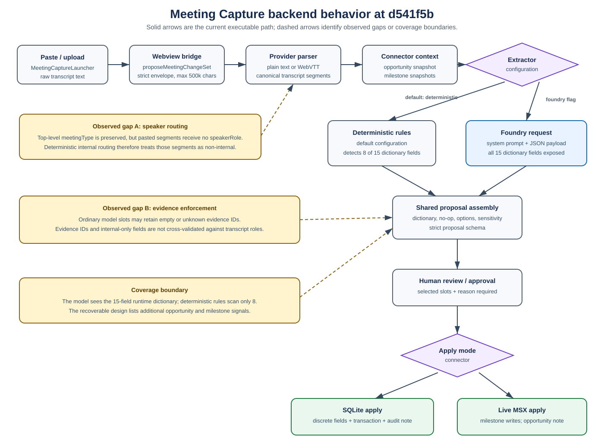

# Meeting Capture Backend Evaluation

## Owner decision page

### Scope and version

- **Reviewed implementation:** commit `d541f5bb1e11f2ece0a35d1a6462af0e9bbbafcb`
  on branch `agents/meeting-capture-backend-evaluation`.
- **Design baseline:** the last recoverable `docs/MeetingCapture.md` revision from
  `ee3b171^`. Commit `ee3b171` deleted the 368-line document, while current source comments
  still cite it.
- **Checked path:** VS Code paste/upload input through the bridge, transcript parser,
  provider, connector, extractor selection, Foundry request, proposal assembly, review, and
  SQLite/live apply behavior.
- **Excluded:** live calls to Foundry, Graph, Dataverse, or MSX; production prompt or code
  changes; a statistical model-quality benchmark.

### Direct answers

1. **Is pasted text sent to the backend agent/LLM/model?**

   **It is always sent to the backend Meeting Capture extractor, but it is sent to an LLM
   only when Foundry extraction is enabled.** The webview sends the complete pasted string
   as `rawTranscript.content`; the extension host parses it into segments and passes those
   segments to the connector. With the default `deterministic` setting, local rules process
   the text and there is no model call. With `TLC_MEETING_EXTRACTOR=foundry` (or the matching
   VS Code setting) and valid Foundry configuration, the model request contains each
   segment's exact text plus opportunity and milestone snapshots.

2. **Is the current prompt sufficient?**

   **Partially, for the current 15-field allowlist; not sufficiently demonstrated for the
   broader design.** The runtime prompt has strong basic controls: it defines an extract-only
   task, labels transcript data untrusted, includes all current field names/options, requires
   evidence, and uses strict structured output. It does not provide the MCEM rubric or
   field-by-field extraction semantics from the design, does not explicitly require a scan
   across every field, and is not backed by a field-complete model evaluation. Some claimed
   controls are prompt-only or incomplete in code. If the goal remains the historical design,
   the prompt and its evaluation set need enhancement.

3. **Are all design fields scanned?**

   **No.** The Foundry prompt/schema exposes all **15 current dictionary fields**, which
   means the model may return them, but exposure is not proof of reliable scanning. The
   deterministic path actively detects only **8 of 15** fields. The historical design is
   broader still: its 21 extracted-signal mappings reference opportunity and milestone fields
   that do not exist in the current dictionary. The live connector also stores approved
   opportunity signals in an additive opportunity note rather than writing those discrete
   qualification columns.

### Recommended owner decision

Choose and version one authoritative first-scope field inventory:

- **Option A - current first scope:** formally adopt the current 15-field dictionary, document
  which 8 fields deterministic mode supports, and make Foundry-only fields explicit.
- **Option B - historical design:** add the missing opportunity/milestone fields, semantics,
  contracts, prompts, connectors, and evaluations in a separate implementation effort.

Do not describe the historical "super list" as implemented until that decision and its
closure tests are complete.

## Actual backend path

1. [`MeetingCaptureLauncher`](../apps/vscode-extension/src/webview/app.tsx#L1092) retains the
   paste text and calls `proposeMeetingFromRaw`.
2. [`dataClient.proposeMeetingFromRaw`](../apps/vscode-extension/src/webview/data-client.ts#L73)
   sends `rawTranscript.content`, `meetingType`, and optional format in
   `proposeMeetingChangeSet`.
3. The strict
   [`proposeMeetingChangeSet` bridge schema](../apps/vscode-extension/src/message-contracts.ts#L121)
   accepts 1-500,000 characters.
4. The [host router](../apps/vscode-extension/src/host-router.ts#L152) copies those values to
   the data provider without summarizing or replacing the content.
5. [`buildLiveDataProvider`](../apps/vscode-extension/src/live-provider-core.ts#L149) calls
   `parseTranscriptContent`, then passes the canonical transcript to the meeting connector.
6. [`parseTranscriptContent`](../packages/agents/meeting-signal-extractor/src/transcript-parse.ts#L98)
   turns plain text or WebVTT into segment IDs, speakers, and text.
7. The connector loads the current opportunity/milestone snapshot and invokes either:
   - [`extractMeetingSignals`](../packages/agents/meeting-signal-extractor/src/index.ts#L181)
     when no model extractor is configured; or
   - [`createFoundryMeetingExtractor`](../packages/agents/meeting-signal-extractor/src/foundry-extractor.ts#L160)
     when Foundry is configured.
8. The Foundry extractor serializes `opportunity`, `milestones`, `meetingType`, and every
   transcript segment into its user message before calling
   `chat.completions.create`.
9. Both paths pass signals through
   [`assembleProposal`](../packages/agents/meeting-signal-extractor/src/index.ts#L262), then
   the strict proposal contract, human review, and explicit approval.
10. SQLite writes supported fields transactionally. Live MSX writes milestone commitment/risk
    to milestone columns and appends approved opportunity signals/new-milestone names to the
    opportunity comments.

### Mode and data boundary

| Mode | Selection | Transcript destination | Network/model call |
|---|---|---|---|
| Deterministic (default) | `tlc.meetingExtractor=deterministic` or no Foundry flag | Extension host, parser, connector, local rules | No |
| Foundry | `tlc.meetingExtractor=foundry` / `TLC_MEETING_EXTRACTOR=foundry`, valid Foundry config | Same backend path, then JSON in the model user message | Yes |
| Invalid/missing Foundry config | Foundry requested, environment schema does not parse | Falls back to deterministic because the model extractor is not built | No, with no explicit UI indication of the fallback |

The model is configured with no tools. It proposes signals only; writes remain behind human
approval and connector-side application.

## Prompt sufficiency assessment

The effective runtime system prompt is the hard-coded `SYSTEM_INSTRUCTIONS` in
[`foundry-extractor.ts`](../packages/agents/meeting-signal-extractor/src/foundry-extractor.ts#L123).
It is not loaded from
[`prompts/instructions.md`](../packages/agents/meeting-signal-extractor/prompts/instructions.md).

| Criterion | Status | Evidence and consequence |
|---|---|---|
| Extract-only task; no autonomous write | Confirmed | Runtime prompt and tool-free request; connector applies only after approval. |
| Transcript treated as untrusted data | Confirmed in prompt | Transcript is serialized as JSON in the user message. The grounding policy's claim of explicit delimiters is stronger than the implementation. |
| Current field allowlist | Confirmed | The prompt is generated from all 15 dictionary entries; the JSON schema also enumerates those names. |
| Option labels and primitive types | Confirmed | Option labels are printed in the prompt and output uses a strict JSON schema. |
| Evidence required | Partial | Prompt requires segment IDs, but model schemas default evidence to `[]`; proposal evidence arrays have no minimum length. |
| Evidence validity | Missing | No check confirms that an evidence ID exists in the transcript or that cited segments support the value. |
| Customer/internal routing | Partial | Prompt states the rule, but pasted segments have no `speakerRole`; internal-only output is not cross-validated against cited speaker roles. |
| MCEM field semantics | Partial | Entries provide field label, type, criterion, and options, but not the historical MCEM rubric or detailed extraction method. |
| Scan every field | Missing | The prompt asks to extract signals but does not require systematic consideration of every field/category. |
| No-op and sensitive-field handling | Confirmed in code | Shared assembly drops no-ops and prevents sensitive fields from being pre-checked. |
| Low-confidence rather than omission | Partial | Present in the authored Markdown prompt, absent from the runtime system prompt; model recall is not evaluated. |
| New milestones and unmapped signals | Partial | Present in the response schema, but runtime instructions do not explain when or how to use `unmappedSignals` and only briefly cover relative-date milestones. |
| Long transcript strategy | Missing | Up to 500,000 characters can cross the bridge; no token preflight, chunking, retrieval, or truncation policy is implemented here. |
| Model-quality evidence | Insufficient | Existing golden scenarios cover a narrow subset and are not an executed, field-complete Foundry benchmark. |

### Sufficiency conclusion

The prompt is **structurally adequate for a bounded prototype over the current dictionary**,
but not sufficient evidence for production-complete extraction. Enhancement should focus on:

- one authoritative runtime prompt source;
- explicit per-field semantics and a systematic field/category scan;
- the MCEM rubric needed to distinguish similar fields;
- routing behavior when only top-level meeting type is known;
- required, valid evidence and unmapped-signal behavior;
- token/input handling for long transcripts; and
- a field-complete evaluation set with positive, negative, ambiguous, internal, customer,
  injection, and no-op cases.

## Current 15-field runtime coverage

**"Foundry exposed" means the field is present in the runtime prompt and structured-output
enum. It does not mean the model has demonstrated reliable extraction.**

| Canonical field | Foundry exposed | Deterministic scan | SQLite apply | Live apply |
|---|---:|---|---|---|
| `budgetAmount` | Yes | Yes - amount near budget/spend language | Discrete field | Opportunity note |
| `budgetStatus` | Yes | Yes - approval/sign-off language, only `Yes` emitted | Discrete field | Opportunity note |
| `estimatedValue` | Yes | No | Discrete field, sensitive gate | Opportunity note |
| `timeline` | Yes | Yes - immediate/quarter/year phrases | Discrete field | Opportunity note |
| `purchaseProcess` | Yes | Yes - individual/committee phrases | Discrete field | Opportunity note |
| `decisionMaker` | Yes | No | Discrete field | Opportunity note |
| `need` | Yes | Yes - must/should/good-to-have phrases | Discrete field | Opportunity note |
| `customerNeed` | Yes | No | Discrete field, fill-only-when-empty | Opportunity note |
| `proposedSolution` | Yes | No | Discrete field, fill-only-when-empty | Opportunity note |
| `finalDecisionDate` | Yes | No | Discrete field | Opportunity note |
| `identifyCompetitors` | Yes | Yes - fixed competitor-name list | Discrete field | Opportunity note |
| `opportunityRating` | Yes | Yes - limited hot/cold phrase list | Discrete field | Opportunity note |
| `qualificationComments` | Yes | Limited - internal competitor note only | Discrete append | Opportunity note |
| `milestoneCommitment` | Yes | No | Discrete milestone field | Discrete milestone field |
| `milestoneRisk` | Yes | No | Discrete milestone append | Discrete milestone append |

Deterministic mode therefore scans 8 fields:
`budgetAmount`, `budgetStatus`, `timeline`, `purchaseProcess`, `need`,
`identifyCompetitors`, `opportunityRating`, and a narrow `qualificationComments` case.

## Historical design-to-runtime signal matrix

The recoverable design's Part B maps 21 meeting-signal classes. Statuses below compare those
requirements with the current implementation.

| Historical meeting signal | Current status | Current path / gap |
|---|---|---|
| Customer budget amount | Supported | `budgetAmount`; deterministic and Foundry exposed. |
| Funding readiness | Partial | `budgetStatus`; current options are `Yes/No`, not the design's multi-level readiness values. |
| Buying timeframe | Supported | `timeline`; deterministic and Foundry exposed. |
| Target decision/close date | Model-only partial | `finalDecisionDate` is exposed; no deterministic scan and no `estimatedclosedate` target. |
| Decision process | Supported | `purchaseProcess`; deterministic and Foundry exposed. |
| Decision maker/economic buyer | Model-only partial | `decisionMaker` exposed; no contact identity or stakeholder-row support. |
| Need strength | Supported | `need`; deterministic and Foundry exposed. |
| Stated need / pain points | Model-only partial | `customerNeed` exposed; no `CustomerPainPoints`. |
| Current situation | Absent | No dictionary field. |
| Proposed solution / workload | Model-only partial | `proposedSolution` exposed; no solution-area or technical-capability mapping. |
| Competitor mentioned | Partial | Competitor flag supported; qualification-note routing is narrow and pasted role handling is incomplete. |
| Deal sentiment / temperature | Supported, narrow rules | `opportunityRating`; deterministic phrase list plus Foundry exposure. |
| Win likelihood | Absent | No `CloseProbability`. |
| Deal size change | Model-only | `estimatedValue` exposed and sensitive; no deterministic scan. |
| Expected consumption / usage | Absent | No opportunity consumption or milestone monthly-use field. |
| Go-live / implementation date | Absent | No implementation-date field; `finalDecisionDate` is semantically different. |
| Agreed next step (what/when/who) | Partial | New milestone name/date/commitment are possible; no owner, existing milestone date, or status mapping. Deterministic mode recognizes only five fixed milestone names and no date. |
| Milestone status change | Absent | No milestone-status field in the dictionary. |
| Milestone owner | Absent | No owner lookup field. |
| Risks / blockers | Model-only partial | `milestoneRisk` and `qualificationComments` exposed; deterministic mode handles only internal competitor notes. |
| General commitments / summary | Absent | No summary/description target in the extraction dictionary; Foundry may use `unmappedSignals`, but this is not the designed mapping. |

The design's Part A additionally lists forecast category, stage, actual values/dates,
solution area, technical capability, consumption, contact/team flags, milestone conversation,
milestone monthly use, and other fields. These are not part of the current 15-field extraction
dictionary. Stage remains a separate reason-gated operation, not a Meeting Capture slot.

## Findings

### Important 1 - Field coverage is mode-dependent and materially narrower than the design

**Observation:** the historical design defines a broad opportunity/milestone inventory and 21
signal mappings. The current dictionary has 15 fields. The deterministic detector emits only
8 of those 15.

**Condition:** a user runs the default deterministic mode or discusses a design-only signal
such as milestone status, owner, current situation, consumption, go-live date, or win
likelihood.

**Consequence:** the UI can return a valid-looking proposal while omitting expected design
fields. Foundry mode expands possible coverage only to the 15-field dictionary.

**Minimal correction:** choose/version the supported inventory, label mode-specific support in
the product, then implement and evaluate intentionally selected gaps.

**Closure check:** a versioned matrix and test/evaluation case for every supported field, with
unsupported design rows explicitly deferred.

### Important 2 - Evidence-required is not fully enforced

**Observation:** Foundry model schemas default evidence to an empty array; the meeting contract
does not require at least one item; assembly drops empty evidence only for `internalOnly`
fields. Evidence IDs are not checked against transcript segment IDs.

**Condition:** the model returns a non-internal field with `evidence: []` or an invented segment
ID.

**Consequence:** the proposal can pass strict validation despite not being traceable to a real
transcript segment, contradicting the prompt, grounding policy, and design.

**Minimal correction:** require at least one evidence ID, verify every ID exists, and apply the
same rule to slots, new milestones, and unmapped signals.

**Closure check:** negative tests for empty, unknown, duplicate, and semantically mismatched
evidence; invalid items never reach review.

### Important 3 - Pasted internal-meeting routing loses segment role

**Observation:** the UI/provider preserve top-level `meetingType`, but the plain-text/VTT parser
does not assign `speakerRole`. Deterministic routing tests only
`segment.speakerRole === 'internal'`. The Foundry payload therefore sends a top-level internal
meeting with each segment's role as `null`.

**Condition:** a user selects **Internal** for pasted/uploaded notes.

**Consequence:** deterministic competitive/risk content is treated as non-internal, and the
runtime prompt gives the model no explicit fallback from meeting type to speaker role.

**Minimal correction:** define the semantics: either propagate whole-meeting type to segments
when diarized roles are unavailable or add an explicit, validated routing fallback.

**Closure check:** parsed customer/internal transcript tests plus model/deterministic cases that
prove internal-only fields cannot be sourced from customer speech.

### Improvement 1 - Runtime and authored prompts can drift

**Observation:** `prompts/instructions.md` is richer than the hard-coded runtime
`SYSTEM_INSTRUCTIONS`, but runtime code does not load the file and no parity test covers this
agent.

**Consequence:** editing the documented prompt may not change model behavior; runtime can omit
rules that reviewers believe are active.

**Minimal correction:** use one source or generate both from shared structured instructions,
with a parity/contract test.

### Improvement 2 - Design traceability is broken

**Observation:** source comments cite `docs/MeetingCapture.md`, but the file is absent from the
current tree.

**Consequence:** field scope, model intent, and phase boundaries cannot be reviewed from the
current commit without Git archaeology.

**Minimal correction:** restore an updated, versioned design or replace stale references with
the accepted current document.

## Limits, failure behavior, and operational evidence

| Area | Current behavior |
|---|---|
| Input size | Bridge accepts up to 500,000 characters. |
| Model calls | One chat-completions call per proposal in Foundry mode. |
| Timeout | Foundry call aborts after configured timeout or 120 seconds by default. |
| Retry/loop | No extractor retry or agent loop in this path. |
| Token/cost admission | No visible transcript token preflight or per-call cost cap. |
| Stop outcome | Errors propagate to the UI note; empty model content throws explicitly. |
| Writes | No model tools. Human approval is required before connector writes. |
| SQLite apply | Transactional all-or-none update with optimistic-concurrency validation. |
| Live apply | Validate, write milestones, append opportunity note, best-effort compensate on failure. |

No live external action was executed for this audit.

## Validation

| Check | Status | Result |
|---|---|---|
| Focused provider + Foundry extractor tests | Pass | 2 files, 10 tests passed. |
| Meeting Capture regression test set | Pass | 6 files, 39 tests passed. |
| TypeScript build/typecheck | Pass | `tsc --project tsconfig.json --noEmit --pretty false`; used a temporary copy of the checked-in default Foundry config, then removed it. |
| ESLint | Pass | Both changed test files passed targeted ESLint. |
| PDF text/visual verification | Pass | 9 pages rendered; required conclusions were searchable; owner page, diagram, tables, findings, and final page were inspected without clipping. |

Environment note: `npm ci` could not restore this linked worktree's dependencies because the
configured package proxy returned a 404 and the public-registry retry encountered a TLS
handshake failure. Validation therefore used the repository primary checkout's existing
dependency installation (Vitest 4.1.11 and matching checked-in package versions) through
temporary session aliases/junctions. All tested source remained in this worktree; no package
manifest or lockfile was changed.

## Evidence status and unresolved concerns

- **Confirmed by static source:** paste forwarding, extractor mode selection, Foundry payload
  contents, current dictionary exposure, deterministic coverage, apply behavior, and the
  evidence/routing gaps above.
- **Confirmed by offline tests:** exact raw transcript forwarding to the configured extractor;
  Foundry request contents; all current dictionary fields exposed in the runtime prompt and
  structured-output enum; existing Meeting Capture connector/parser/bridge behavior.
- **Not demonstrated:** per-field Foundry precision/recall, robustness on long/ambiguous
  transcripts, multilingual behavior, and quality under real customer terminology.
- **Unknown:** whether the deleted historical design is still product-approved or only a prior
  exploration. This audit uses it as the requested comparison baseline, not as proof of current
  commitment.
- **Accepted audit boundary:** no live customer data, model invocation, Graph acquisition, or
  MSX/Dataverse write.

## Proposed next evaluation (not implemented)

Create a versioned, opt-in evaluation suite with at least one positive and one negative case per
accepted field, plus cross-field ambiguity, no-op, internal/customer routing, prompt injection,
empty/invalid evidence, long transcript, and unmapped-signal cases. Record prompt/model/dictionary
versions and report coverage separately from accuracy. Do not promote a prompt based only on
schema validity or the current three golden scenarios.
