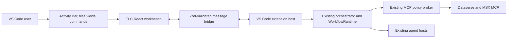

# TLC Assist VS Code Extension Implementation Plan

Status: Proposed; planning only  
Branch: `feature/vscode-extension`  
Scope: VS Code extension host, user experience, read-only Portfolio and Plays, delegated MCP access, testing, and release  
Implementation rule: complete and validate one increment before starting the next

## 1. Objective

Deliver TLC Assist as a trusted local VS Code extension that exposes two coherent modes:

1. **Portfolio Operations** - portfolio, account, and opportunity views; named plays; workflow runs; operational queues; source health; and evidence.
2. **Opportunity Assist** - account and opportunity context, MCEM stage review, four agent capabilities, guidance handoff, and export or e-mail actions.

The extension must reuse the existing contracts, workflow runtime, connectors, MCP policy broker, agents, and React experience. It must not become a separate product implementation or introduce another workflow engine for v1.

The first production release is delegated-user, read-only, and human-reviewed. It must not broaden the signed-in user's Dataverse or MSX permissions.

## 2. Inputs and Decision Record

This plan consolidates the current repository design with earlier extension-layout proposals recovered from prior Copilot sessions.

Current repository inputs:

- `docs/DataverseMCP-MergedDecisionBrief.md`
- `docs/DataverseMCP-ExecutionSequence.md`
- `docs/DataverseMCP.md`
- `docs/PRD.md`
- `packages/orchestrator/workflows/configured-host.ts`
- `apps/desktop/renderer-revamp/src/data-client.ts`
- `apps/desktop/renderer-revamp/src/App.tsx`

Recovered prior proposals established these presentation decisions:

- A TLC Activity Bar container is the entry point and shows connection state.
- A native sidebar tree provides compact navigation for accounts, opportunities, plays, and recent runs.
- The editor area hosts the full portfolio dashboard and detailed workflow results because the experience is too dense for a sidebar.
- Workflow runs, operational queue items, and source health are adjacent supporting views, not competing primary pages.
- Command Palette actions provide shortcuts for common plays.
- Copilot chat participation is optional and follows the stable dashboard and workflow experience.

Earlier feasibility and TODO documents were created in a prior session on another revision but are not present in this branch. This plan preserves their recovered conclusions without treating the missing files as current branch artifacts.

## 3. Architecture Decision

Treat the extension as a third trusted host over the existing host-neutral product layers.



### 3.1 New application boundary

Create `apps/vscode-extension` as an npm workspace with:

```text
apps/vscode-extension/
  package.json
  tsconfig.json
  .vscode-test.mjs
  src/
    extension.ts
    host.ts
    authentication.ts
    message-contracts.ts
    webview-controller.ts
    views/
  test/
  media/
```

The final names may follow repository conventions discovered during implementation, but ownership remains:

- **Extension host:** activation, configuration, authentication, orchestration, policy, filesystem operations, and disposal.
- **Webview:** rendering and user interaction only.
- **Typed bridge:** request correlation, cancellation, strict parsing, bounded responses, and normalized errors.
- **Existing packages:** domain behavior, workflow execution, MCP guards, evidence lineage, and agent behavior.

### 3.2 Reuse matrix

| Existing capability                   | Extension action                                                                   |
| ------------------------------------- | ---------------------------------------------------------------------------------- |
| Common contracts and configuration    | Reuse unchanged unless a host-neutral contract gap is proven                       |
| `createConfiguredWorkflowHost`        | Reuse with an extension-host access-token or host-mediated MCP adapter             |
| Workflow cohort and runtime           | Reuse unchanged                                                                    |
| Dataverse/MSX MCP adapters and broker | Reuse with existing default-deny policy                                            |
| `RevampDataClient`                    | Extract to a shell-neutral boundary and add a VS Code implementation               |
| React renderer                        | Reuse components and domain presentation; adapt shell chrome and responsive layout |
| Electron IPC and web HTTP transports  | Do not reuse; add a validated VS Code message transport                            |
| E-mail, export, and evidence opening  | Adapt to VS Code dialogs, filesystem APIs, and `env.openExternal`                  |

## 4. End-User Information Architecture

The extension must be understandable without knowing MCP, connector topology, or internal agent names. Navigation follows the user's work hierarchy:

```text
TLC Assist
├─ Home
│  ├─ Weekly focus
│  ├─ Open risks
│  └─ Recommended plays
├─ Portfolio
│  ├─ Accounts
│  ├─ Opportunities
│  └─ Governance exceptions
├─ Plays
│  ├─ Recommended for my role
│  ├─ All plays
│  └─ Recent runs
└─ Connection
   ├─ Signed-in identity
   ├─ Dataverse/MSX health
   └─ Sample or live mode
```

### 4.1 Surface responsibilities

| Surface                    | Purpose                          | Content constraints                                                   |
| -------------------------- | -------------------------------- | --------------------------------------------------------------------- |
| Activity Bar               | Stable TLC entry point           | One recognizable icon and one container                               |
| Primary sidebar            | Orientation and quick navigation | Compact trees, badges, refresh, no dense dashboards                   |
| Editor workbench           | Main operating workspace         | Portfolio dashboard, selected entity, play launcher, results          |
| Secondary sidebar or panel | Supporting context               | Runs, queue, source health; one selected supporting view at a time    |
| Command Palette            | Fast repeat actions              | Open TLC, refresh, run named play, open latest run, connection status |
| Status bar                 | Exceptional state only           | Live/sample and degraded/unauthorized state; no persistent noise      |

### 4.2 Editor workbench hierarchy

The workbench uses a predictable top-to-bottom hierarchy:

1. **Context header** - breadcrumb `Portfolio > Account > Opportunity`, current mode, freshness, and refresh.
2. **Primary navigation** - `Overview`, `Plays`, `Guidance`, and `MCEM Stages`; only tabs relevant to the current scope are enabled.
3. **Summary band** - three to five role-relevant metrics or alerts, never a wall of cards.
4. **Main content** - one dominant task: inspect portfolio, select a play, review results, or work guidance.
5. **Supporting details** - evidence, source activity, parameters, and run metadata through drawers or expandable regions.
6. **Action area** - clear next action such as `Run play`, `Send to guidance`, `Export`, or `Open evidence`.

### 4.3 Portfolio and Plays presentation

- Default to the user's role-relevant plays; place the complete catalog behind `All plays`.
- Preserve explicit scope: `Portfolio -> Account -> Opportunity`.
- Use descriptive play names and outcome summaries; workflow IDs are secondary metadata.
- Use one-click defaults. Reveal parameters only when a user chooses `Configure`.
- Present run state consistently: queued, running, complete, partial, unauthorized, failed, or cancelled.
- Render deterministic output as typed metric strips, record tables, action lists, timelines, and queue rows, not raw JSON or generic Markdown cards.
- Keep evidence and MCP activity available for trust, but subordinate to the result and next action.
- Preserve selection when moving between sidebar and editor workbench.

### 4.4 Opportunity Assist presentation

- Keep account and opportunity context visible while guidance is open.
- Present the four capabilities as user tasks, not infrastructure:
  - Account Pulse
  - MCEM Coach
  - Pursuit
  - Risk & Play
- Each response follows the shared response hierarchy: summary, context, observed signals, risks, recommended actions, sources, assumptions, and optional customer-ready draft.
- Guidance handoff starts from a selected queue item and carries its scope and evidence without requiring the user to re-enter context.

### 4.5 Visual and interaction rules

- Use VS Code theme variables and support light, dark, and high-contrast themes.
- Keep layouts dense but calm: clear section headings, aligned columns, stable widths, and deliberate whitespace.
- Avoid cards nested inside cards and avoid treating every section as a floating card.
- Use familiar icons for actions and tooltips for unfamiliar icons.
- Support keyboard navigation, visible focus, screen readers, zoom, reduced motion, and narrow editor columns.
- Prefer `getState` and `setState` for lightweight webview state; do not retain hidden webviews unless measurements justify the memory cost.
- Do not expose tokens, raw MCP payloads, internal stack traces, or unrestricted records in the webview.

### 4.6 UX validation gate

Before connecting live data, produce a fixture-backed walkthrough for these journeys:

1. Open TLC and understand current identity, mode, and data health.
2. Move from Portfolio to an account and opportunity without losing orientation.
3. Find a recommended play, inspect its purpose, and run it with defaults.
4. Interpret a complete, partial, and unauthorized result.
5. Move a queue item into agent guidance and return to the originating run.
6. Use the same journey with keyboard only and at 200% zoom.

The UX owner and one representative end user must confirm that labels, hierarchy, and next actions are understandable before Phase 3 begins.

## 5. Testing Contract for Every Increment

No increment advances on implementation alone. Every increment follows this loop:

1. Add or update the narrowest automated test first when practical.
2. Make one bounded production change.
3. Run focused unit or contract tests for the touched behavior.
4. Run the extension typecheck and lint checks.
5. Run the smallest Extension Development Host E2E scenario that exercises the change.
6. Run affected repository regression tests.
7. Record command, result, date, environment, and evidence in the ledger in Section 12.
8. Stop on failure. Repair and repeat the same gate before proceeding.

Required test layers:

| Layer                 | Purpose                                                         | Default tool                                                                                            |
| --------------------- | --------------------------------------------------------------- | ------------------------------------------------------------------------------------------------------- |
| Unit                  | Message parsing, routing, configuration, state transformations  | Vitest                                                                                                  |
| Contract              | Webview/host envelopes and shared schema compatibility          | Vitest                                                                                                  |
| Component             | Hierarchy, states, keyboard behavior, responsive rendering      | Existing React test pattern or the smallest compatible addition                                         |
| Extension integration | Activation, commands, views, lifecycle, trust modes             | `@vscode/test-cli` and `@vscode/test-electron`                                                          |
| Webview E2E           | Real Extension Development Host interaction                     | Existing Playwright approach if reliable; otherwise VS Code integration driver with screenshot evidence |
| Repository regression | Existing desktop, web, workflow, connector, and security checks | Current npm scripts                                                                                     |
| Live smoke            | Delegated read-only MCP behavior                                | Opt-in, never required for deterministic CI                                                             |

Fixture-backed tests are the release gate. Live tests add environment evidence but cannot replace deterministic fixtures.

## 6. Phased Delivery Plan

### Phase 0 - Decisions, UX prototype, and authentication proof

Goal: eliminate the two largest risks before broad implementation: confusing placement and an unsupported auth assumption.

#### Increment 0.1 - Lock extension contribution map

Change:

- Document exact commands, Activity Bar container, tree views, webview panel, settings, and context keys.
- Create low-fidelity fixture-backed layouts for Home, Portfolio, Plays, and a run result.
- Decide which supporting content uses the secondary sidebar versus an in-workbench drawer.

Focused validation:

- Walk through the six UX journeys in Section 4.6.
- Check all actions have one obvious location and every view has a clear parent in the hierarchy.
- Check narrow editor width, 200% zoom, dark, light, and high-contrast themes.

Stop/go:

- Proceed only when a representative user can locate Portfolio, run a play, and explain a partial result without implementation guidance.

#### Increment 0.2 - Scaffold the minimal extension shell

Change:

- Add the extension workspace, manifest, build, lint, package, and test scripts.
- Register `TLC: Open Assist` and a placeholder editor webview.
- Add Extension Development Host launch and test configurations.

Focused validation:

- Unit test activation/disposal registration.
- Launch with F5; invoke the command; verify one panel opens and reopening reveals the same panel.
- Run one automated extension integration smoke test.
- Run root structure, typecheck, and lint checks.

Stop/go:

- Extension activates without startup errors and disposes all registrations cleanly.

#### Increment 0.3 - Prove the supported delegated MCP route

Change:

- Build a disposable read-only spike behind a development-only command.
- Try the documented VS Code-host-mediated MCP mechanism first.
- Evaluate `vscode.authentication.getSession` only with a documented provider and supported scopes.
- Do not scrape credential storage or assume a Copilot Chat token is accessible to an extension.
- Invoke one bounded Dataverse read and, separately, one curated MSX read if available.

Focused validation:

- Confirm signed-in principal and Dataverse privilege enforcement with a safe, bounded read.
- Verify cancellation, denied consent, unauthorized, unavailable server, and account-switch behavior.
- Verify tokens and raw authorization headers do not enter logs, webview messages, telemetry, or snapshots.

Stop/go:

- Live mode proceeds only if an official extension-accessible mechanism completes delegated read-only calls without a new TLC-owned app registration requiring unavailable tenant-wide consent.
- A successful Copilot/VS Code MCP call proves service feasibility, not extension token access. If extension-controlled invocation cannot be proven, record live mode as blocked and continue sample-mode work without representing the blocker as solved.

### Phase 1 - Sample-mode native shell

Goal: establish an orderly VS Code experience before adapting the full product UI.

#### Increment 1.1 - Activity Bar and connection view

Change:

- Add the TLC Activity Bar container.
- Add a compact Home/Connection tree with mode, identity, source health, and refresh.
- Keep sample mode as the default development setting.

Focused validation:

- Tree item unit tests and activation-event integration tests.
- E2E: open TLC from Activity Bar, refresh, and open the workbench.
- Check trusted and untrusted workspace behavior separately.

Stop/go:

- Identity and mode are visible, no secret data appears, and the view is usable at narrow sidebar widths.

#### Increment 1.2 - Portfolio navigation tree

Change:

- Add lazy Portfolio -> Account -> Opportunity navigation using sanitized fixtures.
- Preserve selected scope using extension state.
- Add refresh and empty/error states.

Focused validation:

- Unit tests for lazy loading, stable item IDs, state restoration, and error normalization.
- E2E: expand portfolio, choose an account and opportunity, reload the window, and verify restored context.

Stop/go:

- Navigation remains responsive and selection is consistent between sidebar and workbench.

#### Increment 1.3 - Plays and recent runs navigation

Change:

- Add Recommended Plays, All Plays, and Recent Runs nodes.
- Add commands to open a play or run in the editor workbench.

Focused validation:

- Unit tests for role/scope filtering and command arguments.
- E2E: launch a recommended fixture play and open its completed run.

Stop/go:

- Users see a small recommended set first and can still reach the complete catalog.

### Phase 2 - Shell-neutral React workbench and typed bridge

Goal: reuse the current product experience without carrying Electron or web-host assumptions into VS Code.

#### Increment 2.1 - Extract shell-neutral UI boundary

Change:

- Extend shell concepts to include VS Code without adding VS Code APIs to shared React components.
- Separate reusable workbench content from desktop-only chrome and exit behavior.
- Preserve desktop and web behavior.

Focused validation:

- Existing component/unit tests.
- Existing desktop and web Playwright journeys.
- New fixture render for the VS Code shell.

Stop/go:

- Desktop and web regressions remain green and reusable UI has no direct dependency on `vscode`.

#### Increment 2.2 - Add strict bridge contracts

Change:

- Define discriminated Zod schemas for every request, response, event, cancellation, and normalized error.
- Add correlation IDs, method allowlist, payload limits, and timeout behavior.
- Reject unknown keys and unknown methods.

Focused validation:

- Contract matrix for valid and invalid envelopes, duplicates, stale replies, cancellation, oversized payloads, and redaction.
- Security test proving arbitrary webview messages cannot invoke unregistered host operations.

Stop/go:

- Every boundary payload parses on both sides and failures reveal no token, raw MCP response, or stack trace.

#### Increment 2.3 - Add VS Code `RevampDataClient`

Change:

- Implement the current data-client interface over the typed message bridge.
- Begin with sample accounts, opportunities, milestones, and workflow operations.
- Implement disposal so pending requests reject predictably when the panel closes.

Focused validation:

- Unit tests for request correlation, cancellation, panel disposal, and response parsing.
- Host/client parity tests against desktop/web fixture envelopes.
- E2E: load the workbench, navigate sample data, close during a request, and reopen cleanly.

Stop/go:

- Sample data journeys work through the real extension boundary with no direct webview data access.

#### Increment 2.4 - Apply VS Code webview security and theming

Change:

- Add nonce-based strict CSP, minimal `localResourceRoots`, bundled local assets, and sanitized dynamic values.
- Apply VS Code theme variables and accessibility classes.
- Persist only bounded, non-sensitive UI state.

Focused validation:

- CSP tests reject inline and remote scripts.
- Package inspection verifies only intended runtime assets.
- E2E screenshots for light, dark, high contrast, narrow editor, and 200% zoom.
- Keyboard and screen-reader semantic checks for primary journeys.

Stop/go:

- No CSP violations, overlap, clipped controls, inaccessible actions, or unbounded persisted records.

### Phase 3 - Portfolio and deterministic Plays in sample mode

Goal: deliver the core extension value with deterministic data before enabling live enterprise access.

#### Increment 3.1 - Portfolio overview

Change:

- Present portfolio metrics, priority exceptions, and scoped account/opportunity navigation in the editor workbench.
- Synchronize sidebar selection and workbench breadcrumb.

Focused validation:

- Component tests for loading, empty, populated, partial, and error states.
- E2E: Portfolio -> Account -> Opportunity -> back to Portfolio with preserved selection.

Stop/go:

- Scope is always visible and no navigation path strands the user.

#### Increment 3.2 - Plays catalog and launcher

Change:

- Present role-recommended plays, complete catalog, filters, purpose, expected output, source plan, and default parameters.
- Add one-click run and progressive `Configure` controls.

Focused validation:

- Filter and scope contract tests.
- E2E: discover, configure, run, cancel, retry, and return to catalog.
- Validate layout at desktop, split-editor, and narrow widths.

Stop/go:

- A user can choose the correct play by name and purpose without relying on workflow IDs.

#### Increment 3.3 - Typed results, queue, and recent runs

Change:

- Render metrics, tables, exceptions, actions, timelines, queue items, evidence, and activity using existing result unions.
- Show source health, freshness, truncation, and partial/unauthorized states.
- Connect recent runs in the sidebar to selected results in the workbench.

Focused validation:

- Golden fixture tests for every result-card type and state.
- E2E for complete, partial, unauthorized, failed, cancelled, and truncated runs.
- Keyboard traversal and screen-reader labels for tables, queue actions, and evidence links.

Stop/go:

- Results communicate what happened, what is missing, and what the user can do next.

### Phase 4 - Delegated live Dataverse/MSX MCP

Goal: replace fixtures with bounded live reads while preserving the same UI and contracts.

Prerequisite: Increment 0.3 has a supported green path. If not, this phase remains blocked.

#### Increment 4.1 - Production host composition

Change:

- Load MCP registry, tool policy, entity map, feature flags, and delegated scope resolver in the extension host.
- Construct the existing configured workflow host once per appropriate extension lifecycle.
- Dispose pools on deactivation and identity/configuration change.

Focused validation:

- Configuration and lifecycle unit tests.
- Fixture MCP integration tests for allowlisted reads, cancellation, timeout, retry, disposal, and source health.
- E2E: switch sample/live setting and verify explicit mode presentation.

Stop/go:

- Live mode cannot activate with invalid configuration or disabled policy, and sample mode remains usable.

#### Increment 4.2 - Live portfolio read pilot

Change:

- Enable one policy-approved Dataverse portfolio workflow for a small pilot cohort.
- Retain row caps, field allowlists, delegated scope predicates, and evidence lineage.

Focused validation:

- Existing broker, adapter, workflow, and security suites.
- Opt-in E2E with an authorized account: run, cancel, partial source, denied source, and no-result cases.
- Compare live result shape with its golden fixture; record only metadata evidence.

Stop/go:

- The result is correctly scoped to the signed-in user, bounded, redacted, and understandable in every state.

#### Increment 4.3 - Curated MSX enrichment and composite plays

Change:

- Add policy-approved MSX reads.
- Preserve deterministic routing: curated MSX where available, otherwise Dataverse; composite retrieval uses Dataverse first and MSX enrichment second.

Focused validation:

- Precedence, deduplication, optional-source failure, timeout, and lineage tests.
- Opt-in E2E for Dataverse-only, MSX-only, composite, and partial composite paths.

Stop/go:

- No duplicate calls, ambiguous source ownership, or loss of the core Dataverse result when optional enrichment fails.

### Phase 5 - Opportunity Assist and guidance handoff

Goal: expose the existing guided opportunity experience after the portfolio foundation is stable.

#### Increment 5.1 - Account, opportunity, milestone, and MCEM views

Change:

- Connect the scoped workbench tabs to extension-host operations.
- Keep v1 live operations read-only; any existing mutation UI remains disabled or clearly sample-only.

Focused validation:

- Existing domain and connector tests plus bridge contracts.
- E2E for selection, refresh, evidence review, stage assessment, unauthorized, and stale data.

Stop/go:

- The UI never implies that a write occurred and clearly labels observations versus recommendations.

#### Increment 5.2 - Four task-oriented capabilities

Change:

- Add Account Pulse, MCEM Coach, Pursuit, and Risk & Play with starter prompts and freeform input.
- Keep agent execution and credentials in the host.

Focused validation:

- Agent contract, markdown safety, missing-evidence, and cancellation tests.
- E2E for each capability using deterministic fixtures; one opt-in live smoke per approved capability.

Stop/go:

- Responses follow the shared hierarchy, cite evidence, label assumptions, and expose useful next actions.

#### Increment 5.3 - Queue-to-guidance handoff and native actions

Change:

- Send a selected queue item into the appropriate capability with scope and evidence preserved.
- Add open evidence, save export, and e-mail draft through VS Code APIs.

Focused validation:

- Handoff contract and provenance tests.
- Filesystem/export tests using temporary locations.
- E2E: run play -> select item -> guidance -> open evidence -> export; verify return navigation.

Stop/go:

- No context is silently dropped and all outbound content remains user-reviewed.

### Phase 6 - Hardening, accessibility, telemetry, and performance

Goal: reach pilot quality without relaxing security or usability.

#### Increment 6.1 - Workspace Trust and restricted mode

Change:

- Declare explicit untrusted-workspace support.
- Keep remote enterprise reads independent of workspace files where safe.
- Disable any operation that reads workspace content or writes files until trust is granted.

Focused validation:

- Separate trusted and untrusted `@vscode/test-cli` configurations with isolated user data.
- E2E verifies truthful explanations and no hidden bypass.

#### Increment 6.2 - Accessibility and responsive quality

Change:

- Resolve issues from keyboard, screen-reader, high-contrast, reduced-motion, zoom, and narrow-layout audits.

Focused validation:

- Automated accessibility checks where compatible.
- Manual keyboard journey and screenshot matrix.
- No overlapping, clipped, off-screen, or pointer-only controls.

#### Increment 6.3 - Safe observability and performance budgets

Change:

- Add opt-in operational telemetry containing metadata only.
- Measure activation, first workbench paint, first portfolio result, bridge payload size, and memory use.

Focused validation:

- Secret and enterprise-record pattern scans over logs and telemetry fixtures.
- Cold/warm activation benchmarks and representative run benchmarks.
- Verify hidden webviews do not continue unnecessary work.

Initial budgets to validate and revise with evidence:

- Extension activation does not block VS Code startup.
- Placeholder workbench visible within 1 second after command invocation on a representative machine.
- Sample portfolio interactive within 2 seconds.
- Deterministic live core result retains the repository target of P50 below 10 seconds.

Stop/go for Phase 6:

- Security review has no unresolved high-severity issue.
- Accessibility journeys pass.
- Performance evidence meets agreed budgets or has an approved exception.

### Phase 7 - Packaging, pilot, and release

Goal: produce a reproducible VSIX, validate the installed artifact, then expand distribution deliberately.

#### Increment 7.1 - VSIX packaging

Change:

- Add `@vscode/vsce`, prepublish build, `.vscodeignore`, README, changelog, support information, and non-SVG marketplace assets.
- Pin a justified `engines.vscode` floor.

Focused validation:

- Run all release gates.
- Package with `vsce package`.
- Inspect VSIX contents for source, tests, secrets, maps, and unnecessary assets.
- Install into a clean VS Code and VS Code Insiders profile and repeat the critical fixture journey.

#### Increment 7.2 - Private read-only pilot

Change:

- Distribute a versioned VSIX to a small approved cohort.
- Keep live MCP and individual plays independently feature-flagged and default-off until approved.

Focused validation:

- Capture activation, auth, unauthorized, latency, accessibility, and comprehension evidence.
- Run a rollback drill by disabling live flags and returning users to sample mode.

#### Increment 7.3 - Marketplace or managed enterprise distribution

Change:

- Select public Marketplace, private organizational distribution, or both based on data classification and support policy.
- For Marketplace automation, prefer Microsoft Entra workload identity over long-lived PATs.
- Use `--pre-release` for pilot channels and distinct versions for release.

Focused validation:

- Clean-profile install/upgrade/uninstall tests.
- Stable and Insiders compatibility tests.
- Final security, privacy, support, licensing, and rollback approval.

Stop/go:

- Release only after the installed VSIX, not merely the source tree, passes the critical E2E suite.

## 7. Inner Development Loop

### 7.1 One-time setup

Expected commands after the extension workspace exists:

```powershell
npm install
npm run build --workspace apps/vscode-extension
npm run test:extension --workspace apps/vscode-extension
```

### 7.2 Interactive development

1. Open the repository in VS Code or VS Code Insiders.
2. Select the extension-host launch configuration.
3. Press F5 to compile and launch the Extension Development Host.
4. Run `TLC: Open Assist` or select TLC in the Activity Bar.
5. For host changes, use `Developer: Reload Window` in the Extension Development Host.
6. For webview-only changes, use `Developer: Reload Webview` when sufficient.
7. Inspect the webview with `Developer: Toggle Developer Tools`.
8. Use the extension-host Debug Console for host breakpoints and logs.

Keep a fixture-only launch profile so UI and bridge work never depends on corporate connectivity. Keep live profiles opt-in and visually unmistakable.

### 7.3 Focused validation order

For each change:

```text
focused unit/contract test
-> extension typecheck/lint
-> one Extension Development Host E2E journey
-> affected repository regression
-> evidence ledger update
```

Use isolated user-data directories and disable unrelated extensions in automated extension tests to prevent local state from masking failures.

## 8. Deployment Model

### Development

- F5 launches an Extension Development Host using the checked-out source.
- No installation or publication is required.

### Private pilot

```powershell
npx vsce package --pre-release
code-insiders --install-extension .\apps\vscode-extension\tlc-assist-<version>.vsix
```

The VS Code UI can also install through `Extensions: Install from VSIX...`.

### Production

- Build and test from a clean CI checkout.
- Package once and promote the same verified artifact.
- Publish with `vsce publish` only after publisher, privacy, support, and distribution decisions are approved.
- Use managed identity/workload federation for automated Marketplace publication where supported.
- Preserve a VSIX rollback path and server-side feature flags for live MCP and each play.

## 9. Authentication and Consent Position

The extension is intended to avoid the specific hosted Easy Auth dependency that required a new TLC-owned Entra app registration and unavailable Microsoft corporate tenant admin consent. It does not eliminate Entra, OAuth consent, conditional access, service allowlisting, or Dataverse authorization.

The prior live query proved that a signed-in VS Code/Copilot MCP path can reach Dataverse and that Dataverse enforces the caller's privileges. It did not prove that an arbitrary extension can retrieve or reuse that token.

Therefore:

- Prefer an official VS Code-host-mediated MCP invocation path where VS Code owns authentication.
- Use the Authentication API only with a documented provider and supported resource scopes.
- Never scrape VS Code or Copilot credential stores.
- Never send an access token to the webview.
- Keep sample mode useful if production delegated auth remains blocked.
- Treat a consent prompt as a tested state, not an impossible state.

## 10. Security and Privacy Gates

Every phase must preserve:

- Delegated-user access and source permission enforcement.
- Default-deny MCP server/tool policy.
- Read-only first release; destructive tools remain blocked.
- Structured query guards; no raw model-authored OData, FetchXML, or SQL.
- Mandatory scope predicates, field allowlists, row limits, and response byte limits.
- Tokens in extension-host memory only.
- Strict CSP, minimal resource roots, and validated bridge messages.
- No prompts, enterprise record bodies, raw MCP responses, or tokens in telemetry.
- Evidence lineage, freshness, partial states, and authorization state in user-visible results.
- Human review before e-mail, export sharing, or any future write.

## 11. Release Acceptance Criteria

The first read-only pilot is acceptable when:

1. The extension installs and activates in supported VS Code Stable and Insiders versions.
2. The Activity Bar, sidebar, and editor workbench present one coherent hierarchy.
3. Portfolio, account, and opportunity context is always visible and preserved.
4. Recommended Plays, All Plays, Recent Runs, queue items, evidence, and source health are discoverable without clutter.
5. Complete, partial, unauthorized, failed, cancelled, and empty states pass E2E tests.
6. Fixture-backed Portfolio and Opportunity Assist journeys pass from an installed VSIX.
7. Live reads use a supported delegated path and remain bounded by existing broker and Dataverse policy.
8. No token or protected record body appears in webview state, logs, telemetry, or test artifacts.
9. Keyboard, screen-reader, high-contrast, reduced-motion, 200% zoom, and narrow-editor checks pass.
10. Existing desktop and web critical journeys remain green.
11. Rollback to sample mode and extension uninstall are tested.
12. Support ownership, privacy statement, release channel, and incident path are documented.

## 12. Increment Evidence Ledger

Update this table immediately after each increment. Do not batch-complete it at the end of a phase.

| Increment    | Change/commit                                                                                                      | Focused tests                                          | Extension E2E                                                           | Regression                                 | UX/security evidence                                                                                                                              | Result/date     | Approver |
| ------------ | ------------------------------------------------------------------------------------------------------------------ | ------------------------------------------------------ | ----------------------------------------------------------------------- | ------------------------------------------ | ------------------------------------------------------------------------------------------------------------------------------------------------- | --------------- | -------- |
| 0.1          | Contribution map in `apps/vscode-extension/package.json`; IA in plan Section 4                                     | n/a (design)                                           | n/a                                                                     | n/a                                        | Hierarchy: Activity Bar + Connection/Portfolio/Plays views + editor workbench                                                                     | Done 2026-09-15 | Pending  |
| 0.2          | Extension shell: `extension.ts`, tree providers, `WorkbenchPanel`, vite host/webview builds                        | 17 vitest (contracts, sample, router)                  | 3 Mocha in Extension Development Host (activate, open, refresh) passing | 301/301 vitest, typecheck, lint, structure | Nonce CSP; VSIX = 10 files, no src/tests/secrets                                                                                                  | Done 2026-09-15 | Pending  |
| 0.3          | TLC: Test Live Connection - getSession(microsoft) token + bounded WhoAmI/opportunities read; token not logged      | command registration integration test                  | 4 Mocha green                                                           | 313 full suite                             | Output channel report; tlc.dynamicsResource setting; run signed-in to confirm gate (admin consent may block)                                      | Impl 2026-09-16 | User-run |
| 1.x          | Activity Bar + Connection/Portfolio/Plays trees (sample)                                                           | Covered by unit/contract                               | Activation E2E green                                                    | Green                                      | Compact trees; workbench command                                                                                                                  | Done 2026-09-15 | Pending  |
| 2.x          | Zod bridge contracts + VS Code data client + CSP webview                                                           | Contract + router tests green                          | Open/refresh E2E green                                                  | Green                                      | Strict envelopes; host-only openEvidence                                                                                                          | Done 2026-09-15 | Pending  |
| 3.x          | Portfolio + MCEM + 4 capabilities + deterministic plays (sample)                                                   | Sample provider workflow-to-completion test            | Workbench opens                                                         | Green                                      | Typed result cards; loading/error/empty states                                                                                                    | Done 2026-09-15 | Pending  |
| 7.1          | VSIX packaging config (`vsce`, `.vscodeignore`, LICENSE)                                                           | n/a                                                    | n/a                                                                     | Green                                      | Packaged 289 KB, runtime-only contents                                                                                                            | Done 2026-09-15 | Pending  |
| 5.3 (export) | Native export action: `export-document.ts`, host save-dialog/write/open, webview Export buttons on MCEM + guidance | 3 export-document unit + 1 router contract (host-only) | 3 Mocha green                                                           | 21/21 extension vitest, typecheck, lint    | Save via `workspace.fs`; markdown with header/timestamp; open-evidence + guidance-handoff deferred (no sample URLs / no fully-scoped queue items) | Done 2026-09-15 | Pending  |
| 5.3 handoff  | Queue->guidance handoff; enriched sample rows carry account+opportunity scope; chains handoff to agent task        | guidance-handoff provenance test (scope + evidenceIds) | 4 Mocha green                                                           | 308/308 full suite                         | Scope + evidence preserved; result shown inline; open-evidence/email deferred (no sample URLs)                                                    | Done 2026-09-15 | Pending  |
| 6.1          | Workspace Trust: manifest untrustedWorkspaces.supported; exportBlockedReason gates file writes; reads stay enabled | export trust-gate unit test                            | 4 Mocha (declares-untrusted-support)                                    | Green                                      | File writes blocked when untrusted with a clear message; sample reads independent of workspace files                                              | Done 2026-09-15 | Pending  |
| 5.3 actions  | Open-evidence (sample evidence URLs + webview Open links) and email-draft (mailto via openExternal)                | mailto builder unit + composeEmail router contract     | 4 Mocha green                                                           | 26 ext vitest                              | openEvidence https-only; email draft user-reviewed in mail client; both host-only and validated                                                   | Done 2026-09-15 | Pending  |
| 5.3 docx/eml | Export writes real .docx and email a full .eml (X-Unsent) draft via desktop generators; MCEM+agent send rich md    | docx/eml reuse; composeEmail{subject,title,body}       | 4 Mocha green                                                           | 309 full suite                             | Host bundled SSR/node (docx browser build referenced document); writes trust-gated; recipients prompt; desktop parity                             | Done 2026-09-15 | Pending  |
| guidance UI  | Per-agent prompt catalogs (?raw) + composer/Send; MCEM Stage Management (adjacent moves); Overview/Guidance/Stages | stage transition unit tests (advance/recycle)          | 4 Mocha green                                                           | 311 full suite                             | Prompts from packages/agents/*/prompts.md; mutable sample store persists stage; styled Email/Word action toolbar on top                           | Done 2026-09-15 | Pending  |
| board+edits  | 5-stage drag/drop board; opportunity sort(3)+comments; milestone sort(4)+5 editable fields via update APIs         | update persistence unit tests (milestone/opportunity)  | 4 Mocha green                                                           | 313 full suite                             | Webview-local sort helpers; mutable milestone store; HTML5 drag/drop with reason-gated adjacent move                                              | Done 2026-09-15 | Pending  |

Add one row for every subsequent increment before implementation starts.

## 13. Known Risks and Responses

| Risk                                                                 | Response                                                                                   |
| -------------------------------------------------------------------- | ------------------------------------------------------------------------------------------ |
| VS Code MCP access available to Copilot but not arbitrary extensions | Make extension-controlled auth/invocation a Phase 0 gate; retain sample mode               |
| Ported desktop UI feels crowded or foreign in VS Code                | Separate native navigation from editor workbench; validate hierarchy before live data      |
| Sidebar duplicates the full workbench                                | Limit sidebar to orientation, selection, status, and shortcuts                             |
| Shared renderer refactor regresses desktop/web                       | Keep shell-neutral extraction small and run existing host E2E immediately                  |
| Webview messages become a privilege escalation surface               | Strict discriminated schemas, method allowlist, scope checks, limits, and security tests   |
| Live tests are flaky or identity-dependent                           | Make fixtures authoritative and live tests opt-in evidence                                 |
| Feature expansion introduces write risk                              | Keep v1 read-only; design writes as a separately approved phase with itemized confirmation |
| Installed VSIX differs from source-tree behavior                     | Run critical E2E against the packaged artifact before release                              |

## 14. Explicitly Deferred

The following are outside the first read-only release:

- Unattended or scheduled workflows that survive VS Code shutdown.
- Shared team queues and cross-device run history.
- Dataverse/MSX writes or automatic customer communication.
- A new durable workflow engine.
- Broad Copilot Agent-mode tools.
- An `@tlc` chat participant before Portfolio and Plays are stable.
- Replacing the existing desktop or web hosts.

These can be reconsidered after pilot evidence demonstrates a user need and the required security and durability model.
