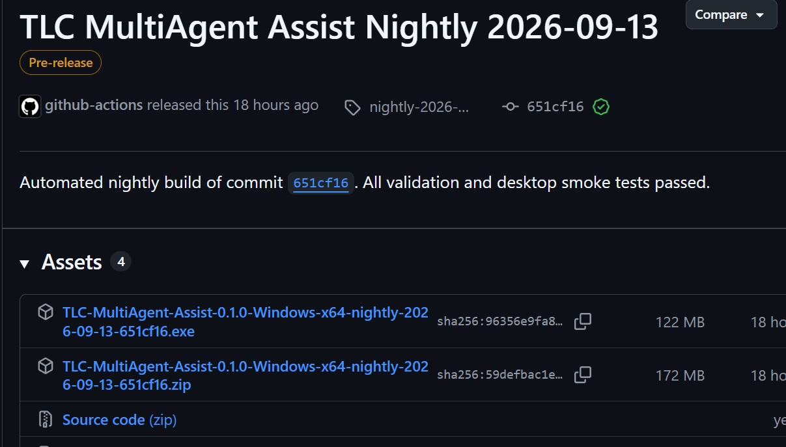
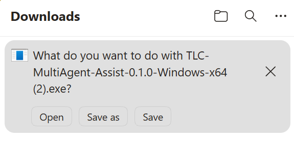
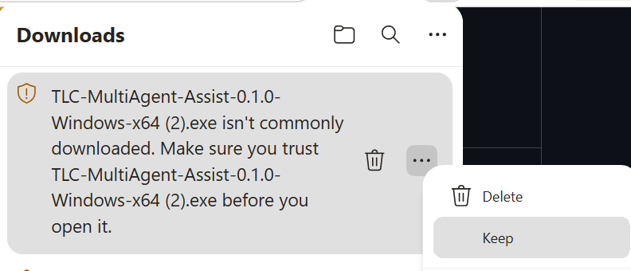
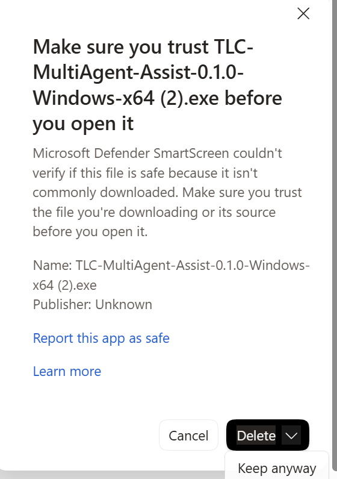
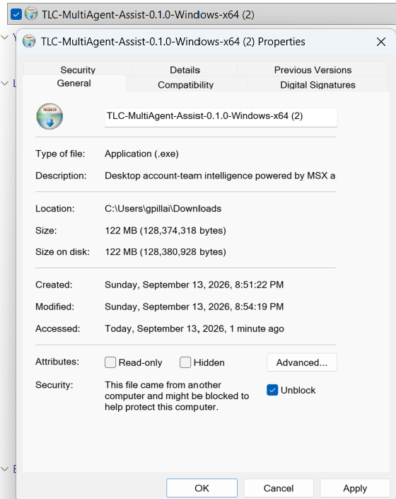
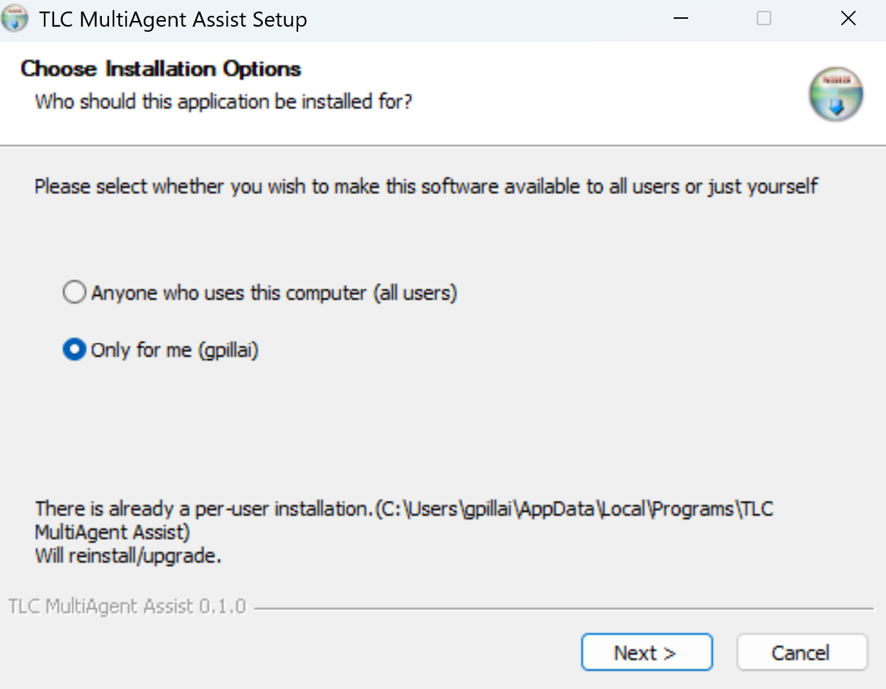
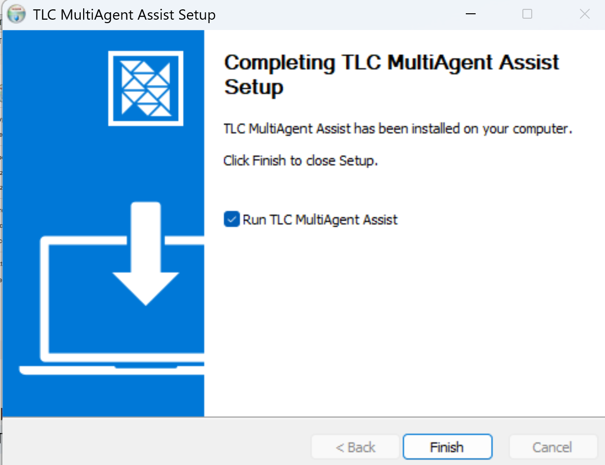

# Install TLC MultiAgent Assist for Windows

This guide explains how to download and install the TLC MultiAgent Assist desktop application on Windows x64.

## 1. Download the desktop release

1. Open the [latest TLC MultiAgent Assist release](https://github.com/kprpg/TLC-MultiAgentAssist/releases/latest).
2. Expand **Assets** if the files are not already visible.
3. Download one of these Windows x64 files:
   - `TLC-MultiAgent-Assist-<version>-Windows-x64.exe` - recommended installer; adds Start menu and desktop shortcuts.
   - `TLC-MultiAgent-Assist-<version>-Windows-x64.zip` - portable version for users without installation access.

Only continue when the download source is this repository's GitHub Releases page and the file name matches one of the patterns above.

## 2. Keep the download if prompted

The application is not currently code-signed, so Microsoft Edge or Microsoft Defender SmartScreen may warn that the file is not commonly downloaded or that its publisher cannot be verified.

In Microsoft Edge:

1. Open **Downloads**.

   

2. Find the TLC MultiAgent Assist download and select **More actions** (**...**).

   

3. Select **Keep**, then **Keep anyway**.

   

Browser wording can differ by version. Do not keep the file if it came from another website or its name does not match the release asset.

## 3. Unblock the downloaded file

1. Open the folder containing the download.
2. Right-click the `.exe` file and select **Properties**.
3. On the **General** tab, select **Unblock** near the bottom of the window.
4. Select **Apply**, then **OK**.

If **Unblock** is not shown, Windows has not marked the file as blocked and you can continue.

## 4. Run the installer

1. Double-click the downloaded `.exe` file.
2. If Windows displays a security prompt, confirm the file name and source before continuing.
3. Choose who can use the application:
   - **Only for me** - installs for your Windows account and normally does not require administrator access.
   - **Anyone who uses this computer** - installs for all users and may require administrator approval.

   

4. Select **Next** and follow the setup prompts.
5. Leave **Run TLC MultiAgent Assist** selected if you want the app to open immediately.
6. Select **Finish**.

You can launch the application later from the Start menu or desktop shortcut.

## Use the portable ZIP instead

1. Download `TLC-MultiAgent-Assist-<version>-Windows-x64.zip` from the release assets.
2. Keep and unblock the ZIP using the same checks above, if Windows prompts you.
3. Right-click the ZIP and select **Extract All**.
4. Open the extracted folder and double-click `TLC MultiAgent Assist.exe`.

The portable version does not run the installer or create shortcuts.

## Next steps

- Continue with the [end-user guide](USER-GUIDE.md) to sign in or run the app with sample data.
- See [desktop setup and troubleshooting](../runbooks/desktop-app.md) if installation or startup fails.
