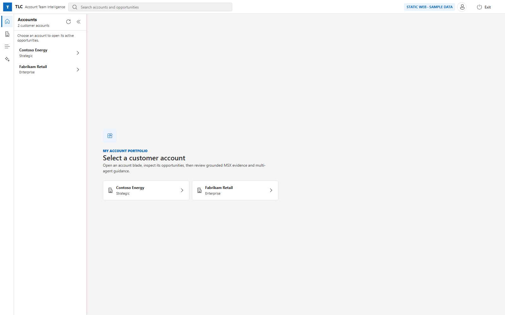
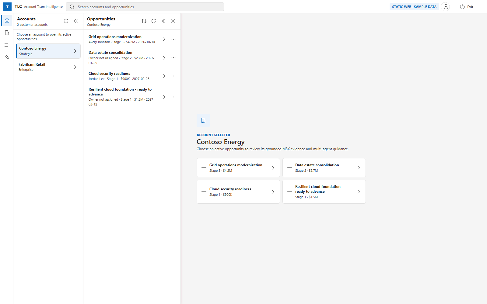
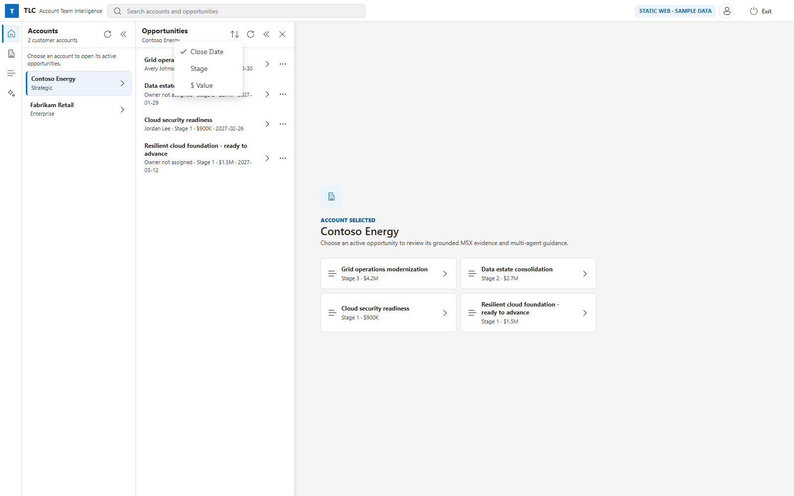
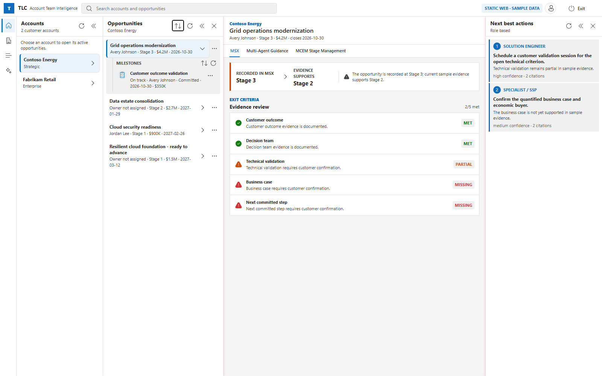
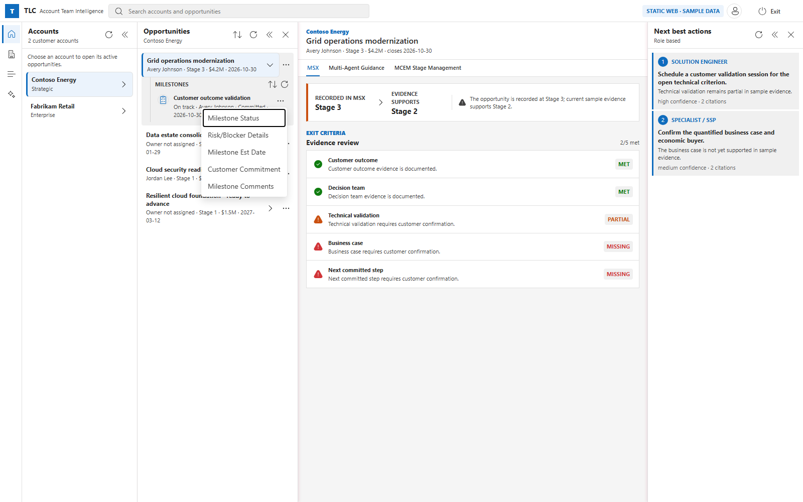
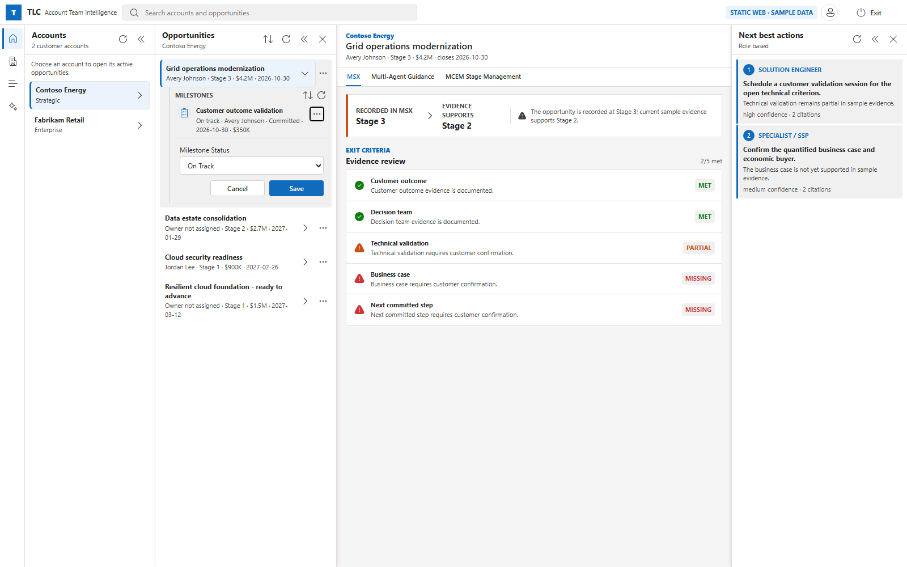
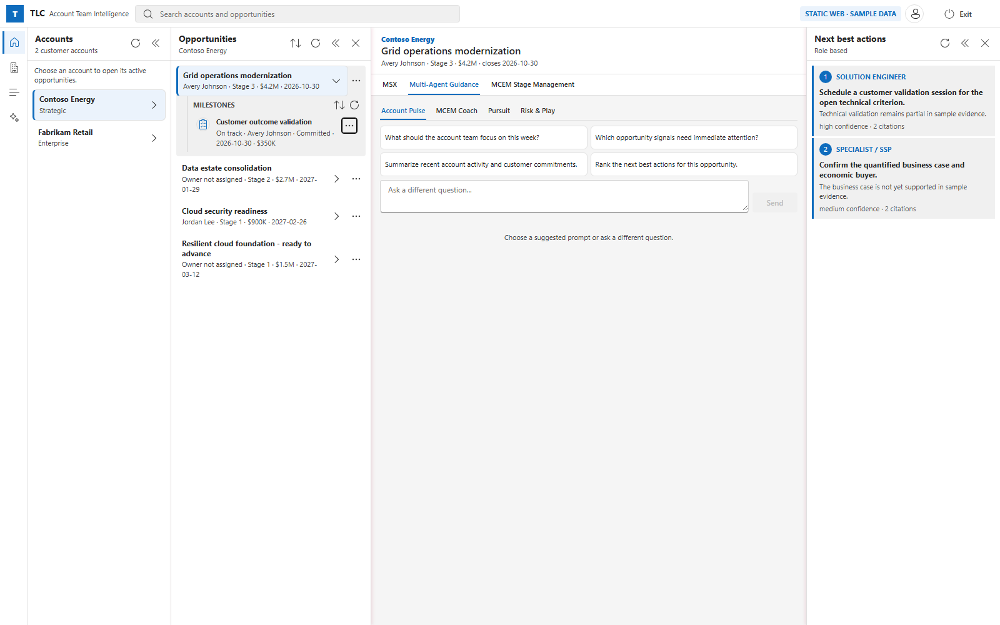
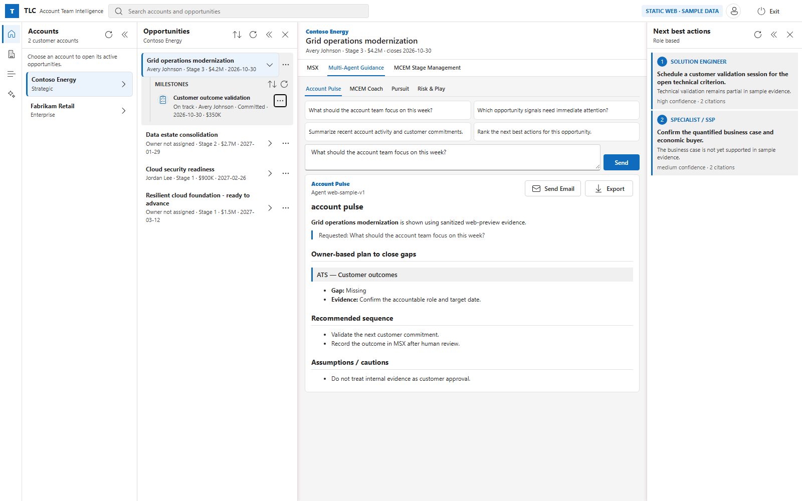
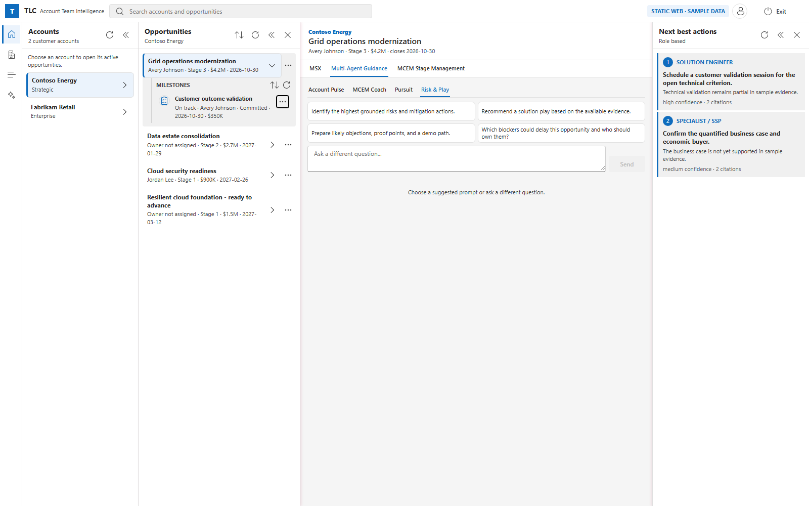
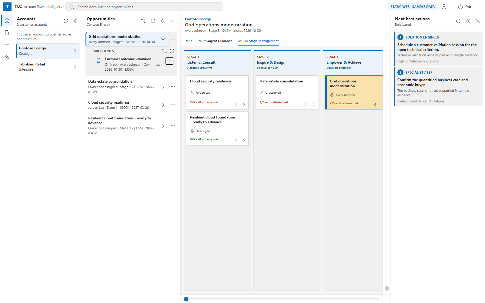

# TLC Multi-Agent Assist — User Guide

TLC Multi-Agent Assist is a role-aware account team assistant. It joins live MSX opportunity data with grounded internal knowledge and four specialized agents that translate evidence into next-best actions.

This guide walks through every user-visible feature. All screenshots come from the sanitized sample dataset shipped with the product; the live experience is identical except that data is pulled from MSX for opportunities on which you are on the deal team.

---

## Table of contents

1. [Launching the app and signing in](#1-launching-the-app-and-signing-in)
2. [The workspace at a glance](#2-the-workspace-at-a-glance)
3. [Accounts blade — selecting an account](#3-accounts-blade--selecting-an-account)
4. [Opportunities blade — reviewing your book of work](#4-opportunities-blade--reviewing-your-book-of-work)
   1. [Sorting opportunities](#41-sorting-opportunities)
   2. [Editing opportunity comments](#42-editing-opportunity-comments)
5. [Milestones — drilling down inside an opportunity](#5-milestones--drilling-down-inside-an-opportunity)
   1. [Sorting milestones](#51-sorting-milestones)
   2. [Editable milestone fields](#52-editable-milestone-fields)
6. [MSX evidence panel](#6-msx-evidence-panel)
7. [Agentic guidance — the four agents](#7-agentic-guidance--the-four-agents)
   1. [Account Pulse](#71-account-pulse)
   2. [MCEM Coach](#72-mcem-coach)
   3. [Pursuit / Executive](#73-pursuit--executive)
   4. [Risk & Solution Play](#74-risk--solution-play)
   5. [Working with an agent response](#75-working-with-an-agent-response)
8. [MCEM Stage Management](#8-mcem-stage-management)
9. [Next-best actions rail](#9-next-best-actions-rail)
10. [Search](#10-search)
11. [Data modes and the top-right badge](#11-data-modes-and-the-top-right-badge)
12. [Exiting the app](#12-exiting-the-app)

---

## 1. Launching the app and signing in

- **Web** — navigate to the production URL provided by your administrator. The App Service redirects unauthenticated users to Microsoft Entra ID; sign in with your `@microsoft.com` corporate account.
- **Desktop (Electron)** — launch **TLC Multi-Agent Assist** from the Start Menu. The app uses the Azure CLI token cached on your machine (`az login` in advance).

After sign-in you land on the empty workspace with your account portfolio in the left blade. No account is opened until you select one.

---

## 2. The workspace at a glance

The workspace is organized into vertical *blades*:

| Region                             | Purpose                                                                                                   |
| ---------------------------------- | --------------------------------------------------------------------------------------------------------- |
| **Command bar** (top)              | Brand, global search, connection badge, signed-in identity, exit.                                         |
| **Primary nav rail** (far left)    | Home, Accounts, Opportunities, Guidance.                                                                  |
| **Accounts blade**                 | Your account portfolio.                                                                                   |
| **Opportunities blade**            | The active opportunities under the selected account, plus a milestone tree once an opportunity is opened. |
| **Workbench** (center)             | Detail view of the selected opportunity — MSX evidence, agent guidance, or MCEM stage board.              |
| **Next best actions rail** (right) | Role-based prioritized next steps derived from the current evidence.                                      |

Every blade has a collapse arrow in its header so you can widen the center workbench during long tasks; the collapse states persist between sessions.

---

## 3. Accounts blade — selecting an account

The **Accounts** blade lists every customer account on which you are on the deal team. Each row shows the account name and its segment (Strategic, Enterprise, and so on).

Select an account either from the left blade or from the large hero cards in the center. The Opportunities blade slides in next to it, scoped to that account.

---

## 4. Opportunities blade — reviewing your book of work

Each row summarizes one active opportunity with:

- Opportunity name
- Owner (or “Owner not assigned”)
- Current recorded MCEM stage
- Estimated value in the opportunity’s currency
- Estimated close date

Hovering an opportunity shows a full tooltip with the stage owner and additional context.

### 4.1 Sorting opportunities

Click the sort icon (⇅) in the Opportunities blade header. A menu lets you sort by:

- **Close Date** — ascending by default; click again to toggle descending.
- **Stage** — descending by default (highest stage first).
- **$ Value** — descending by default.

The active sort is indicated with a check mark, and the button’s tooltip always shows the current sort and direction.

### 4.2 Editing opportunity comments

Right-click an opportunity, or open its **⋯** menu, and choose **Opportunity Comments** to add or update a free-text note. Comments are written back to MSX after human review of the change.

The **⋮** icon menu on each opportunity currently exposes:

- **Opportunity Comments** — inline edit of the opportunity’s comment field.

---

## 5. Milestones — drilling down inside an opportunity

Click an opportunity to *select and expand* it. The workbench center switches to the opportunity’s detail view, and the milestone tree opens beneath it in the left blade.

Each milestone row shows:

- Milestone name
- Status (`On Track`, `At Risk`, `Blocked`, `Completed`, `Cancelled`, `Lost to Competitor`, `Hygiene/Duplicate`)
- Owner
- Customer commitment (`Uncommitted` or `Committed`)
- Milestone estimated date
- Estimated change in monthly usage (in the opportunity’s currency)

### 5.1 Sorting milestones

The sort icon in the milestone tree header opens a menu with:

- **Milestone Est. Date** — ascending by default.
- **Est. Change in Monthly Usage ($ Value)** — descending by default.
- **Customer Commitment** — descending by default.
- **Milestone Status** — descending by default.

The button tooltip always reflects the active sort and its direction.

### 5.2 Editable milestone fields

Open the milestone’s **⋯** menu to reveal every editable field:

- **Milestone Status** — dropdown of the seven allowed status values.
- **Risk/Blocker Details** — free-text description (multi-line).
- **Milestone Est Date** — date picker; a value is required before Save is enabled.
- **Customer Commitment** — `Uncommitted` or `Committed`.
- **Milestone Comments** — free-text (multi-line).

Selecting any field opens an inline editor directly beneath the milestone row. Only that field is editable at a time; Save writes back through the platform and the row refreshes with the new value.

**Save / Cancel** buttons commit or discard the pending change. The editor closes automatically on save.

---

## 6. MSX evidence panel

The **MSX** tab in the workbench summarizes the opportunity’s stage evidence:

- **Recorded in MSX** — the stage the opportunity is currently recorded at.
- **Evidence supports** — the stage the current grounded evidence actually supports.
- **Exit criteria** — five stage-gate criteria (Customer outcome, Decision team, Technical validation, Business case, Next committed step) with per-criterion status: `MET`, `PARTIAL`, or `MISSING`. Each criterion also carries a short rationale.

If the recorded stage and the evidence-supported stage disagree, a warning band explains the gap so you can decide whether to advance, hold, or recycle.

The example screenshot in [§5](#5-milestones--drilling-down-inside-an-opportunity) shows an opportunity recorded at Stage 3 while evidence only supports Stage 2, with two criteria met, one partial, and two missing.

---

## 7. Agentic guidance — the four agents

Open the **Multi-Agent Guidance** tab in the workbench to launch role-specific agents against the current opportunity.

Every agent starts with four suggested prompts. You can either click one (it runs immediately) or type your own question in the *Ask a different question…* box and press **Send**.

### 7.1 Account Pulse

Purpose: weekly pulse-check on the account. Surfaces what the team should focus on now, which signals need attention, recent activity summary, and a ranked list of next best actions.

Default suggested prompts:

1. What should the account team focus on this week?
2. Which opportunity signals need immediate attention?
3. Summarize recent account activity and customer commitments.
4. Rank the next best actions for this opportunity.

A completed Account Pulse response includes an owner-based plan to close gaps, a recommended sequence, and any cautions:

### 7.2 MCEM Coach

Purpose: MCEM stage-progression coaching. Diagnoses which stage the opportunity is truly in, calls out exit criteria that are partial or missing, and proposes the fastest way to close them.

Default suggested prompts:

1. How do we move this opportunity to the next MCEM stage?
2. Which exit criteria are missing or only partially supported?
3. Compare the recorded stage with the evidence-based stage.
4. Create an owner-based plan to close the MCEM gaps.

### 7.3 Pursuit / Executive

Purpose: pursuit planning and executive-ready output. Produces briefs, 30/60-day pursuit plans, meeting talking points and customer asks, and stakeholder engagement strategy.

Default suggested prompts:

1. Create an executive-ready brief for this opportunity.
2. Build a 30/60 day pursuit plan with owners and milestones.
3. Prepare talking points and a customer ask for the next meeting.
4. Identify stakeholder gaps and recommend an engagement strategy.

### 7.4 Risk & Solution Play

Purpose: risk assessment and Microsoft solution-play recommendations. Flags competitor and stall risks, proposes mitigations, and matches the deal to the right Microsoft solution plays and assets.

### 7.5 Working with an agent response

Every agent response follows the same contract:

- A short summary anchored to the opportunity.
- A structured plan mapped to owner *roles* (ATS, Specialist / SSP, Solution Engineer, CSAM, …).
- A recommended sequence of concrete next steps.
- Explicit assumptions and cautions — anything the agent could not confirm from the current evidence.
- Citations to the underlying MSX/MCEM evidence items.

Two actions sit beside a completed response:

- **Send Email** — opens a pre-populated draft in your default Outlook client. Nothing is sent automatically; you review and press *Send* yourself.
- **Export** — downloads the same response as a formatted Word (`.docx`) document ready to attach to a review or QBR deck.

---

## 8. MCEM Stage Management

The **MCEM Stage Management** tab renders the account’s active opportunities as a five-column MCEM board:

- Stage 1 — Listen & Consult *(Account Executive)*
- Stage 2 — Inspire & Design *(Specialist / SSP)*
- Stage 3 — Empower & Achieve *(Solution Engineer)*
- Stage 4 — Realize Value *(Cloud Solution Architect)*
- Stage 5 — Manage & Optimize *(CSAM)*

Each card shows the opportunity name, its owner (or *Unassigned*), and a running exit-criteria score (for example, `2/5 exit criteria met`). Cards in the currently opened opportunity are highlighted.

Use the board to:

- **Spot mispositioned deals** — the “Resilient cloud foundation – ready to advance” card sits in Stage 1 with `5/5 exit criteria met`, meaning the evidence supports advancing to Stage 2.
- **Move a deal between stages** — drag a card left (recycle) or right (advance) to an adjacent stage. Any move that is either non-adjacent, or that has one or more open exit criteria, requires an *exception reason* before it is committed. Recycles always require a reason. The reason and disposition are appended to the opportunity comments as an audit trail.

The board only lets you move to an *adjacent* stage — Stage 2 ⇄ Stage 3 is allowed; Stage 1 ⇄ Stage 4 is not.

---

## 9. Next-best actions rail

The rightmost rail shows the top prioritized actions for the currently selected opportunity, mapped to *roles* rather than to individual people, along with the confidence and citation count for each. Actions are re-ranked whenever the underlying evidence or agent guidance changes.

Example seen in the screenshot in [§5](#5-milestones--drilling-down-inside-an-opportunity):

1. **Solution Engineer** — “Schedule a customer validation session for the open technical criterion.” *high confidence · 2 citations*
2. **Specialist / SSP** — “Confirm the quantified business case and economic buyer.” *medium confidence · 2 citations*

---

## 10. Search

The search box in the command bar (top center) filters *both* accounts and opportunities as you type. Results are grouped by type; selecting a hit opens the associated account and, for opportunity hits, immediately opens that opportunity’s detail view.

---

## 11. Data modes and the top-right badge

A small badge next to your profile in the top-right corner indicates the data mode currently in effect:

| Badge                      | Meaning                                                                                  |
| -------------------------- | ---------------------------------------------------------------------------------------- |
| `STATIC WEB · SAMPLE DATA` | Sanitized sample data, offline. No MSX or Foundry traffic.                               |
| `WEB · CONNECTED DATA`     | Live web mode running behind Azure Easy Auth. MSX and Foundry are called on your behalf. |
| `DESKTOP`                  | Electron desktop client using your local Azure CLI token.                                |

All grounded evidence lines carry a source indicator so you can tell at a glance whether a data point came from MSX, MCEM, or a sample file.

---

## 12. Exiting the app

Click **Exit** in the top-right corner to shut the app down cleanly. In the web experience this signs you out of the App Service session; in the desktop app it terminates the process.
