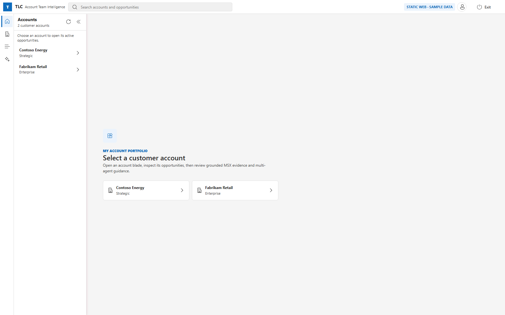
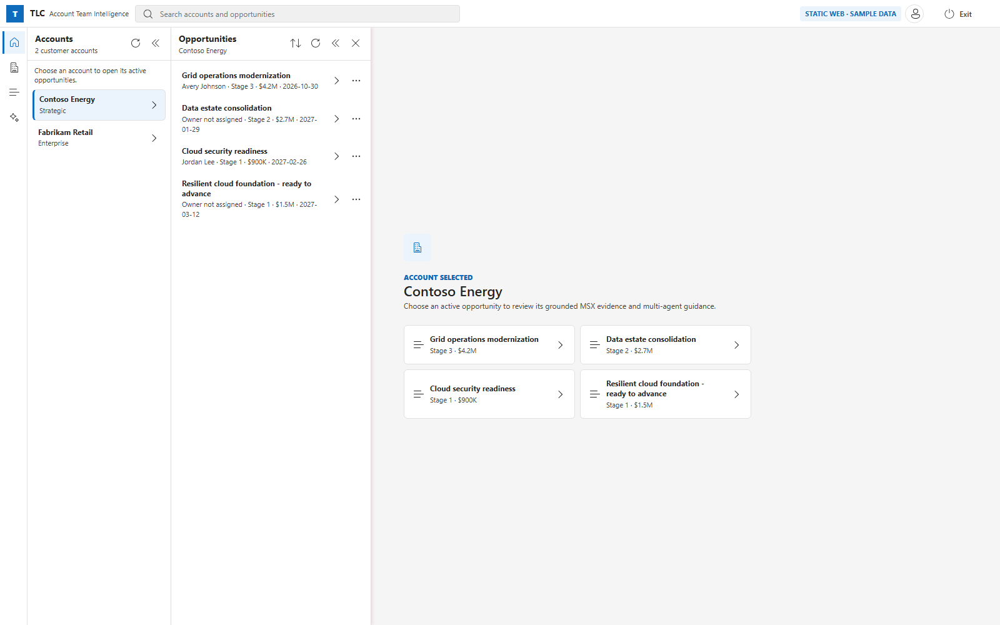
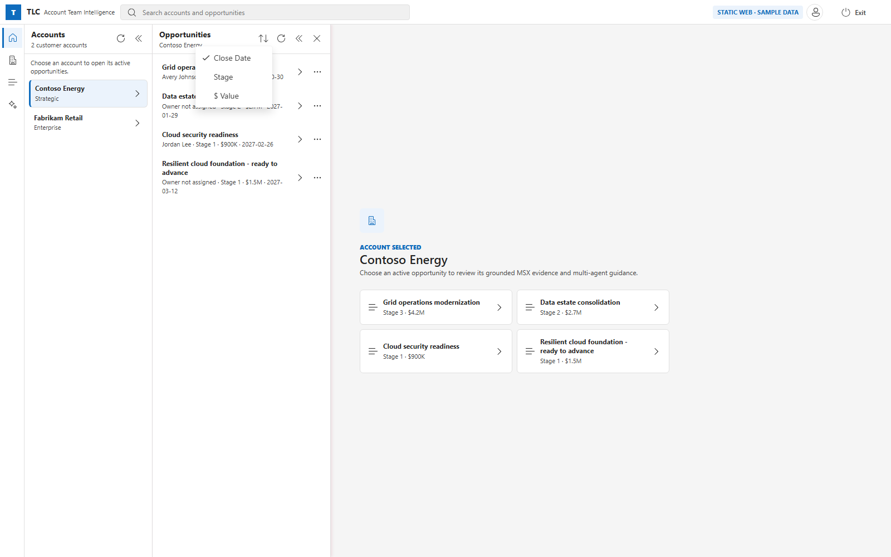
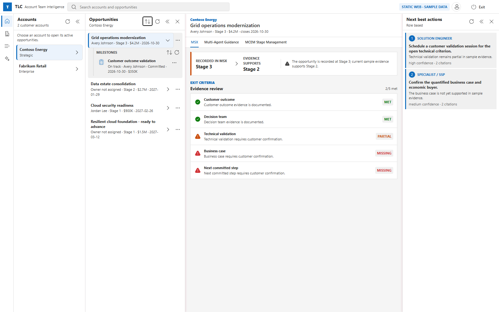
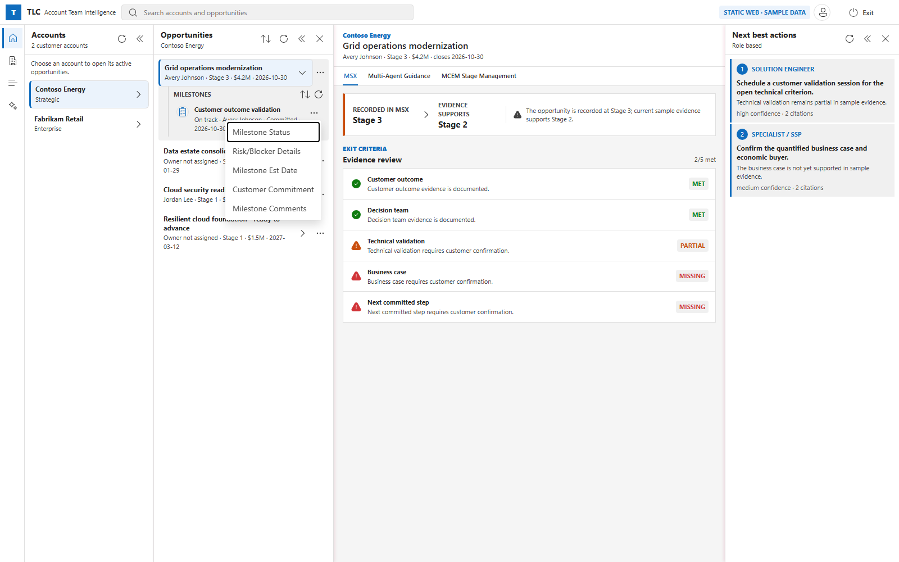
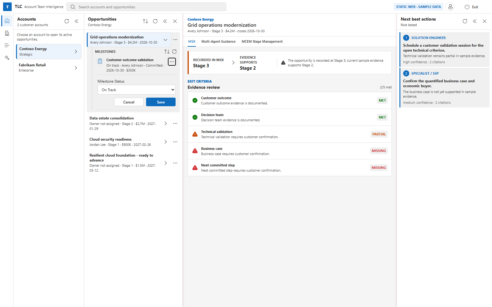
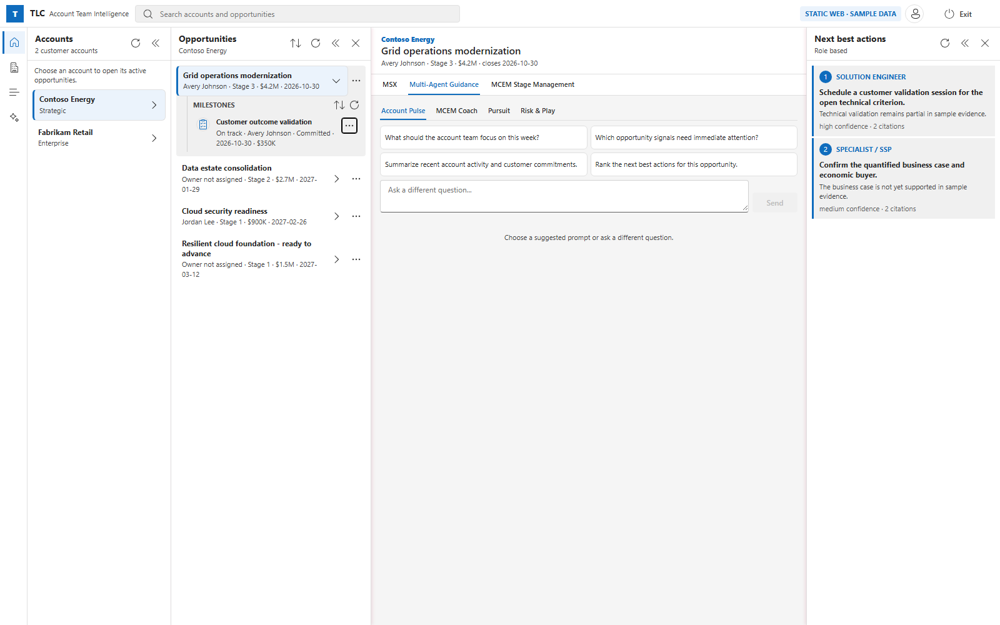
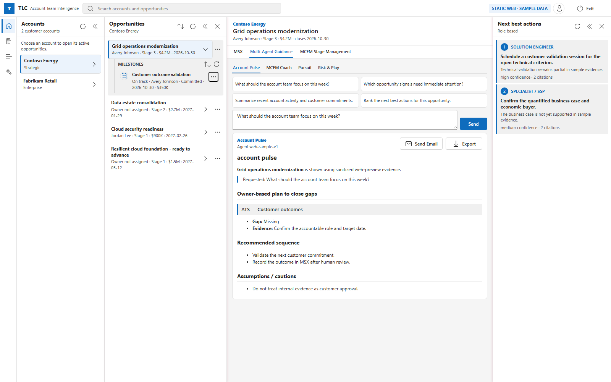
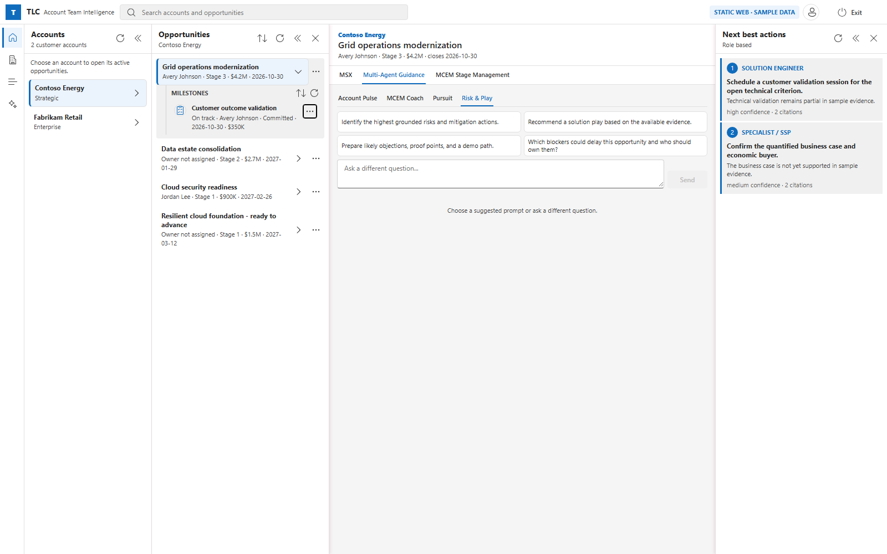
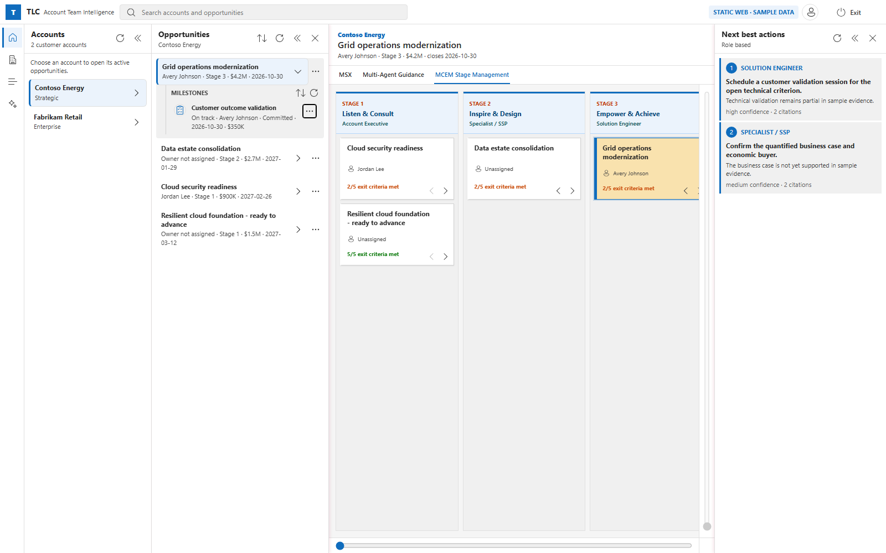

# TLC Multi-Agent Assist — User Guide

TLC Multi-Agent Assist is a role-aware account team assistant. It joins live MSX opportunity data with grounded internal knowledge and four specialized agents that translate evidence into next-best actions.

It ships as two end-user surfaces that share the same feature set — a **VS Code shell extension** and a **Windows desktop application** (the same experience is also hosted as a web app). The two surfaces differ in look and feel, so each part has its own screenshots. This guide is organized into those two parts:

- **[VS Code Shell Extension](#vs-code-shell-extension)** — install, open, and use TLC Assist inside VS Code, with VS Code-specific screenshots.
- **[Desktop Version](#desktop-version)** — install, launch, and run the Windows desktop app, with the full illustrated feature walkthrough.

All screenshots come from the sanitized sample dataset shipped with the product; the live experience is identical except that data is pulled from MSX for opportunities on which you are on the deal team.

---

## Table of contents

**[Part 1 — VS Code Shell Extension](#vs-code-shell-extension)**

- [Install and open in VS Code](#install-and-open-in-vs-code)
  - [The Discover, Portfolio, and Plays tabs](#the-discover-portfolio-and-plays-tabs)
  - [Run the extension in sample mode](#run-the-extension-in-sample-mode)
- [The VS Code experience](#the-vs-code-experience)

**[Part 2 — Desktop Version](#desktop-version)**

- [Install and launch the desktop app](#install-and-launch-the-desktop-app)
- [Run the desktop app with sample data](#run-the-desktop-app-with-sample-data)
1. [The workspace at a glance](#2-the-workspace-at-a-glance)
2. [Accounts blade — curating and selecting accounts](#3-accounts-blade--curating-and-selecting-accounts)
3. [Opportunities blade — reviewing your book of work](#4-opportunities-blade--reviewing-your-book-of-work)
   1. [Sorting opportunities](#41-sorting-opportunities)
   2. [Editing opportunity comments](#42-editing-opportunity-comments)
4. [Milestones — drilling down inside an opportunity](#5-milestones--drilling-down-inside-an-opportunity)
   1. [Sorting milestones](#51-sorting-milestones)
   2. [Editable milestone fields](#52-editable-milestone-fields)
5. [MSX evidence panel](#6-msx-evidence-panel)
6. [Agentic guidance — the four agents](#7-agentic-guidance--the-four-agents)
   1. [Account Pulse](#71-account-pulse)
   2. [MCEM Coach](#72-mcem-coach)
   3. [Pursuit / Executive](#73-pursuit--executive)
   4. [Risk & Solution Play](#74-risk--solution-play)
   5. [Working with an agent response](#75-working-with-an-agent-response)
7. [MCEM Stage Management](#8-mcem-stage-management)
8. [Next-best actions rail](#9-next-best-actions-rail)
9. [Search](#10-search)
10. [Data modes and the top-right badge](#11-data-modes-and-the-top-right-badge)
11. [Exiting the app](#12-exiting-the-app)

---

# VS Code Shell Extension

TLC Assist installs as a self-contained VS Code extension and opens inside the editor. Everything in this part — accounts, opportunities, milestones, the four guidance agents, and the MCEM board — is the same feature set delivered in the [Desktop Version](#desktop-version).

## Install and open in VS Code

1. Install `tlc-assist-vscode-<version>.vsix` from the GitHub Releases page (see the [VS Code extension install guide](VSCODE-EXTENSION-INSTALL.md) for the full steps). Only **VS Code / VS Code Insiders 1.90.0+** is required — no Node.js, npm, sign-in, or network.
2. Run **Developer: Reload Window**, then select the **TLC Assist** icon in the Activity Bar, or run **TLC: Open Assist** from the Command Palette (`Ctrl+Shift+P`).

The extension starts in **sample** mode (sanitized fixtures, no network). To use live data, run **TLC: Use Live Data (MSX/Dataverse)** from the Command Palette (or set `tlc.mode` to `live` in **Settings**) and sign in with VS Code's built-in Microsoft account; the Foundry agents additionally use the Azure CLI (`az login`).

### Switching the data source (sample, SQLite test store, or live)

Two independent toggles control where data comes from:

| Toggle | Setting | Values |
| --- | --- | --- |
| **Mode** | `tlc.mode` | `sample` (sanitized, offline) · `live` (MSX OData + Dataverse MCP) |
| **Sample data store** | `tlc.dataStore` | `fixture` (in-memory) · `sqlite` (relational SQLite test store; injected values persist for the session). Applies only in sample mode. |

- **Switch sample ⇄ live at runtime** from the Command Palette (`Ctrl+Shift+P`): **TLC: Use Live Data (MSX/Dataverse)** or **TLC: Use Sample Data**. The status bar flips between `TLC Assist: Live` and `Sample`, and the panes reload.
- **TLC: Test Live Connection** only *verifies* connectivity to Dataverse — it does **not** switch the data source. Use **Use Live Data** to actually switch.
- You can also set `tlc.mode` / `tlc.dataStore` in **Settings** (`Ctrl+,`, search "tlc").
- **Live requires sign-in:** VS Code's Microsoft account (`@microsoft.com`) and, for the Foundry agents, `az login`. If the delegated token cannot be acquired, the extension shows an error toast and stays on sample — see **Output → TLC Assist** for details.

> **Developing with F5?** The repo includes Extension Development Host launch configs — **Run TLC Assist Extension** (fixtures), **(SQLite test store)**, and **(Live MSX/Dataverse)** — that set the startup data source. After rebuilding the extension, run **Developer: Reload Window** in the Extension Development Host (or relaunch) so the new build loads before switching modes.

### The Discover, Portfolio, and Plays tabs

The TLC Assist view is organized into three tabs:

- **Discover** — browse Solution Engineer domains and join or leave opportunity Deal Teams.
- **Portfolio** — your accounts, opportunities, milestones, MSX evidence, and the four guidance agents, with **Email** and **Word** export on every agent response.
- **Plays** — the operational Plays catalog in the left rail (ordered by workflow number) and the Operational Queue of results. Each queue item can be dispatched to an agent — for example **Send to Pursuit** or **Send to Risk & Play** — and the returned response can be exported with **Email** or **Word**, just like Portfolio guidance.

VS Code also contributes a native **TLC Assist** tree and toolbar commands (**TLC: Refresh Data**, **TLC: Add Customer Account**, **TLC: Toggle Hidden Customers**).

### Run the extension in sample mode

Sample mode is the default and needs nothing else — no sign-in, no network, no Azure CLI. If you previously switched to live mode, run **TLC: Use Sample Data** (or set `tlc.mode` back to `sample` in **Settings**). In sample mode the view loads bundled sanitized data (or the SQLite test store when `tlc.dataStore` is `sqlite`) and never calls MSX or Foundry.

## The VS Code experience

The VS Code extension renders TLC Assist inside the editor, so its chrome — the Activity Bar icon, the editor tab, the native tree, and the VS Code theme — looks and feels different from the standalone desktop window even though the features are the same. The screenshots below are captured from the **Extension Development Host** running in sample mode.

> 📸 **Screenshot to add** — `./media/vscode/01-portfolio.png`: the TLC Assist view open on the **Portfolio** tab, showing the account portfolio, a selected opportunity, and its milestone tree.

> 📸 **Screenshot to add** — `./media/vscode/02-guidance.png`: a completed **Multi-Agent Guidance** response on the Portfolio tab with the **Email** and **Word** buttons visible.

> 📸 **Screenshot to add** — `./media/vscode/03-plays-queue.png`: the **Plays** tab with the catalog rail ordered by workflow number and the Operational Queue, including a **Send to Pursuit** action on a queue item.

> 📸 **Screenshot to add** — `./media/vscode/04-plays-guidance.png`: a Plays queue item dispatched to an agent, showing the returned response with its **Email** and **Word** export buttons.

For the full, step-by-step tour of every feature — accounts, opportunities, milestones, MSX evidence, the four agents, the MCEM board, next-best actions, and search — see the illustrated walkthrough in [Desktop Version](#desktop-version); the behavior is identical in VS Code.

---

# Desktop Version

The Windows desktop application is a standalone Electron window that delivers the same account-team and guidance features as the VS Code extension, with its own look and feel. This part covers desktop install, launch, and sample mode, and then walks through every feature with desktop screenshots. The feature behavior is identical in the [VS Code Shell Extension](#vs-code-shell-extension).

## Install and launch the desktop app

1. Download the Windows installer (`TLC-MultiAgent-Assist-<version>-Windows-x64.exe`) or the portable ZIP from the [latest release](https://github.com/kprpg/TLC-MultiAgentAssist/releases/latest), unblock it, and run it. See the [complete desktop installation guide](DESKTOP-INSTALL.md) for detailed steps and troubleshooting.
2. Launch **TLC Multi-Agent Assist** from the Start Menu. The desktop app uses the Azure CLI token cached on your machine, so run `az login` in advance for live mode.

After sign-in you land on the empty workspace with your account portfolio in the left blade; no account is opened until you select one.



## Run the desktop app with sample data

> **Use sample mode to explore the application without signing in or connecting to MSX, Foundry, Azure, or Microsoft Entra ID.** Close any running instance of TLC Multi-Agent Assist first.

From **Windows Command Prompt** (`cmd.exe`) at the repository root, run:

```cmd
set "TLC_DATA_MODE=sample" && ".\release\win-unpacked\TLC MultiAgent Assist.exe"
```

After downloading the Windows `.exe` from the GitHub Release page and installing it, replace `<UserName>` with your Windows user name, open **Windows Command Prompt** (`cmd.exe`), and run:

```cmd
set "TLC_DATA_MODE=sample" && "C:\Users\<UserName>\AppData\Local\Programs\TLC MultiAgent Assist\TLC MultiAgent Assist.exe"
```

If you downloaded the portable ZIP, extract it, open Command Prompt in the extracted folder, and run:

```cmd
set "TLC_DATA_MODE=sample" && "TLC MultiAgent Assist.exe"
```

Keep the quotes around `TLC_DATA_MODE=sample`. In Command Prompt, an unquoted command such as `set TLC_DATA_MODE=sample && ...` stores a trailing space in the value and causes the app to start in live mode.

For PowerShell, run:

```powershell
$env:TLC_DATA_MODE = 'sample'
& "$env:LOCALAPPDATA\Programs\TLC MultiAgent Assist\TLC MultiAgent Assist.exe"
```

Sample mode loads bundled sanitized data and opens the workspace directly without displaying a login dialog.

## 2. The workspace at a glance

The workspace is organized into vertical *blades*:

| Region                             | Purpose                                                                                                   |
| ---------------------------------- | --------------------------------------------------------------------------------------------------------- |
| **Command bar** (top)              | Brand, global search, connection badge, signed-in identity, exit.                                         |
| **Primary nav rail** (far left)    | Home, Accounts, Opportunities, Guidance.                                                                  |
| **Accounts blade**                 | Your account portfolio.                                                                                   |
| **Opportunities blade**            | The active opportunities under the selected account, plus a milestone tree once an opportunity is opened. |
| **Workbench** (center)             | Detail view of the selected opportunity — MSX evidence, agent guidance, or MCEM stage board.              |
| **Next best actions rail** (right) | Role-based prioritized next steps derived from the opportunity's stage, exit-criteria evidence, and milestone health (status and customer commitment). |

Every blade has a collapse arrow in its header so you can widen the center workbench during long tasks; the collapse states persist between sessions.

---

## 3. Accounts blade — curating and selecting accounts

The **Accounts** blade initially lists the customer accounts associated with opportunities where you are currently a Deal Team member. Each row shows the account name, segment (Strategic, Enterprise, and so on), and whether the account came from Deal Team membership, manual addition, or both.

Select an account either from the left blade or from the large hero cards in the center. The Opportunities blade slides in next to it, scoped to that account.



### 3.1 Adding an account by name or TPID

Select **Add customer** in the Accounts blade header, choose **Account name** or **TPID**, search, and then select **Add account**. A manually added account appears immediately even when it has no Deal Team opportunities.

Adding an account does **not** add all of its opportunities to your Portfolio. Open **Discover opportunities**, choose the appropriate Solution Engineer domain, and use **Add me** or **Remove me** to maintain your actual opportunity-level Deal Team memberships. You can also **expand an opportunity in Discovery** (the chevron beside its name) to list its milestones and use the **+ / −** toggle to join a milestone team without joining the Deal Team — joining a milestone brings that opportunity into your Portfolio.

The resulting working set is:

- visible accounts from Deal Team membership plus manually added accounts;
- active opportunities where you are a current Deal Team member **or** a member of at least one of the opportunity's milestone teams;
- milestones loaded only after you select an eligible opportunity.

Portfolio Plays, agents, milestones, and other downstream analysis use that opportunity working set. A manually added account with no Deal Team or milestone-team opportunities remains as an empty account node so you can return to Discovery later.

### 3.1a Joining or leaving a milestone team

Opportunity Deal Team membership and milestone-team membership are **independent**. You can be on an opportunity's Deal Team without being on any of its milestone teams, and you can be on a milestone team without being on the opportunity's Deal Team.

Each milestone under an opportunity shows a compact **+ / −** toggle beside the milestone name:

- **+** adds you to that milestone's team.
- **−** removes you from that milestone's team (with a short confirmation, because it may change your Portfolio).

Joining a milestone team brings the parent opportunity into your Portfolio even if you are not on its Deal Team. Leaving the Deal Team keeps the opportunity in your Portfolio as long as you remain on at least one of its milestone teams; the opportunity leaves your Portfolio only once you have left both the Deal Team and all of its milestone teams. Milestone-team membership is tracked per signed-in user and is separate from the milestone's **Owner**, which is never changed by the toggle. The toggle behaves identically across the desktop, web, and VS Code UIs.

> In live mode, the milestone **+ / −** toggle adds or removes you from the milestone's Dataverse **Access Team** (the "Milestone Team" tab in MSX), using the standard `AddUserToRecordTeam` / `RemoveUserFromRecordTeam` actions. The "Milestone Team" access-team template is discovered automatically, so **no configuration is required**. If that access team is not set up in the environment, the toggle reports a short, clear message instead of appearing to succeed. Sample mode needs no configuration.

### 3.1b Adding an Activity (Task) to a milestone

Each milestone can carry **Activities** (Tasks), mirroring the MSX milestone **Activities** tab. On the desktop and web UIs, open the milestone's **Actions** menu and choose **Activities**; in the VS Code webview, select **Activities** beside the milestone. The panel lists existing tasks and offers a **New task** form (Subject, Task Category, Due, Priority, Duration, Description). The task owner defaults to you, and the task is linked to the milestone (its **Regarding** record). In live mode this creates a Task in MSX; in sample mode it is kept in the local sample store.

### 3.2 Hiding and unhiding an account

Select **Hide** beside an account to exclude that customer and its opportunities, milestones, Plays, agents, and downstream analysis from TLC Assist. Hiding is a TLC preference and does not remove any MSX Deal Team membership.

Select **Show hidden customers** in the Accounts blade header to display hidden rows, then select **Unhide** to restore an account and its eligible Deal Team opportunities.

Across the desktop, web, and VS Code UIs, action labels and toggle controls such as **Hide**, **Unhide**, sorting, filtering, and **Comments** use the theme's accent/link color (blue in the default themes) to distinguish them from customer and opportunity data. Removal actions such as **Remove me** use red, while disabled controls are muted. Hover and keyboard-focus indicators identify clickable controls without changing their behavior.

In the VS Code webview Portfolio, category and section headings — for example **Accounts**, **Opportunities**, **Milestones**, and **Next Best Actions**, plus panel eyebrows such as **ROLE BASED** and **MCEM Coach** — use a distinct teal heading color. This keeps the structural labels visually separate from both the customer/opportunity data (default text) and the blue interactive controls.

In VS Code's native Portfolio toolbar, **TLC: Refresh Data**, **TLC: Add Customer Account**, and **TLC: Toggle Hidden Customers** use blue icons. Inline **Hide/Unhide Customer** actions also use blue eye icons. In this workspace, native hover text uses a high-contrast blue-on-dark palette; TLC webview popups use the same palette with semibold text. VS Code continues to control the native tooltip font, and customer and opportunity tree labels remain data text.

### 3.3 Filtering and sorting Discovery

The Discovery panel provides the same customer filters and column sorting in the desktop app, web app, and VS Code extension:

- Select **Customers equals all** or **Add filter** to open the customer filter. Choose **equals (include)** to show only selected customers, or **does not equal (exclude)** to leave selected customers out. Search the customer list, select one or more checkboxes, and select **Apply**.
- An include filter matches any selected customer. You can combine it with an exclude filter; excluded customers stay out even if they are also included.
- Select an applied filter chip to edit it, its **x** to remove it, or **Clear filters** to restore all customers in the current domain. The result count shows how many opportunities match.
- Select the **Account**, **Stage**, or **Action** column heading to sort ascending; select it again to sort descending. Account uses alphabetical order, Stage uses numeric order, and Action puts **Add me** before **Remove me / On deal team** in ascending order. The arrow indicates the active direction.

Filters and sorting remain applied when you change Solution Engineer domains. In the desktop and web apps, they also remain applied when you select **Refresh**. If no opportunities match, clear or edit the customer filters. These are view-only controls: they do not hide accounts elsewhere, change Deal Team membership, or alter the Portfolio and Plays working set.

---

## 4. Opportunities blade — reviewing your book of work

Each row summarizes one active opportunity with:

- Opportunity name
- Owner (or “Owner not assigned”)
- Current recorded MCEM stage
- Estimated value in the opportunity’s currency
- Estimated close date

Hovering an opportunity shows a full tooltip with the stage owner and additional context.

### 4.1 Sorting opportunities

Click the sort icon (⇅) in the Opportunities blade header. A menu lets you sort by:

- **Close Date** — ascending by default; click again to toggle descending.
- **Stage** — descending by default (highest stage first).
- **$ Value** — descending by default.



The active sort is indicated with a check mark, and the button’s tooltip always shows the current sort and direction.

### 4.2 Editing opportunity comments

Right-click an opportunity, or open its **⋯** menu, and choose **Opportunity Comments** to add or update a free-text note. Comments are written back to MSX after human review of the change.

The **⋮** icon menu on each opportunity currently exposes:

- **Opportunity Comments** — inline edit of the opportunity’s comment field.

---

## 5. Milestones — drilling down inside an opportunity

Click an opportunity to *select and expand* it. The workbench center switches to the opportunity’s detail view, and the milestone tree opens beneath it in the left blade.



Each milestone row shows:

- Milestone name
- Status (`On Track`, `At Risk`, `Blocked`, `Completed`, `Cancelled`, `Lost to Competitor`, `Hygiene/Duplicate`)
- Owner
- Customer commitment (`Uncommitted` or `Committed`)
- Milestone estimated date
- Estimated change in monthly usage (in the opportunity’s currency)

Portfolio and Discovery lists omit milestones with a `Cancelled` or `Closed` status and milestones whose estimated date is strictly earlier than the calendar date four months ago. Milestones dated exactly four months ago and milestones without an estimated date remain visible. Omitted milestones remain available to grounded internal evaluation and agent guidance as historical evidence.

### 5.1 Sorting milestones

The sort icon in the milestone tree header opens a menu with:

- **Milestone Est. Date** — ascending by default.
- **Est. Change in Monthly Usage ($ Value)** — descending by default.
- **Customer Commitment** — descending by default.
- **Milestone Status** — descending by default.

The button tooltip always reflects the active sort and its direction.

### 5.2 Editable milestone fields

Open the milestone’s **⋯** menu to reveal every editable field:



- **Milestone Status** — dropdown of the seven allowed status values.
- **Risk/Blocker Details** — free-text description (multi-line).
- **Milestone Est Date** — date picker; a value is required before Save is enabled.
- **Customer Commitment** — `Uncommitted` or `Committed`.
- **Milestone Comments** — free-text (multi-line).

Selecting any field opens an inline editor directly beneath the milestone row. Only that field is editable at a time; Save writes back through the platform and the row refreshes with the new value.



**Save / Cancel** buttons commit or discard the pending change. The editor closes automatically on save.

---

## 6. MSX evidence panel

The **MSX** tab in the workbench summarizes the opportunity’s stage evidence:

- **Recorded in MSX** — the stage the opportunity is currently recorded at.
- **Evidence supports** — the stage the current grounded evidence actually supports.
- **Exit criteria** — five stage-gate criteria (Customer outcome, Decision team, Technical validation, Business case, Next committed step) with per-criterion status: `MET`, `PARTIAL`, or `MISSING`. Each criterion also carries a short rationale.

If the recorded stage and the evidence-supported stage disagree, a warning band explains the gap so you can decide whether to advance, hold, or recycle.

The example screenshot in [§5](#5-milestones--drilling-down-inside-an-opportunity) shows an opportunity recorded at Stage 3 while evidence only supports Stage 2, with two criteria met, one partial, and two missing.

---

## 7. Agentic guidance — the four agents

Open the **Multi-Agent Guidance** tab in the workbench to launch role-specific agents against the current opportunity.

Every agent starts with four suggested prompts. You can either click one (it runs immediately) or type your own question in the *Ask a different question…* box and press **Send**.

### 7.1 Account Pulse

Purpose: weekly pulse-check on the account. Surfaces what the team should focus on now, which signals need attention, recent activity summary, and a ranked list of next best actions.

Default suggested prompts:

1. What should the account team focus on this week?
2. Which opportunity signals need immediate attention?
3. Summarize recent account activity and customer commitments.
4. Rank the next best actions for this opportunity.



A completed Account Pulse response includes an owner-based plan to close gaps, a recommended sequence, and any cautions:



### 7.2 MCEM Coach

Purpose: MCEM stage-progression coaching. Diagnoses which stage the opportunity is truly in, calls out exit criteria that are partial or missing, and proposes the fastest way to close them.

Default suggested prompts:

1. How do we move this opportunity to the next MCEM stage?
2. Which exit criteria are missing or only partially supported?
3. Compare the recorded stage with the evidence-based stage.
4. Create an owner-based plan to close the MCEM gaps.


### 7.3 Pursuit / Executive

Purpose: pursuit planning and executive-ready output. Produces briefs, 30/60-day pursuit plans, meeting talking points and customer asks, and stakeholder engagement strategy.

Default suggested prompts:

1. Create an executive-ready brief for this opportunity.
2. Build a 30/60 day pursuit plan with owners and milestones.
3. Prepare talking points and a customer ask for the next meeting.
4. Identify stakeholder gaps and recommend an engagement strategy.


### 7.4 Risk & Solution Play

Purpose: risk assessment and Microsoft solution-play recommendations. Flags competitor and stall risks, proposes mitigations, and matches the deal to the right Microsoft solution plays and assets.



### 7.5 Working with an agent response

Every agent response follows the same contract:

- A short summary anchored to the opportunity.
- A structured plan mapped to owner *roles* (ATS, Specialist / SSP, Solution Engineer, CSAM, …).
- A recommended sequence of concrete next steps.
- Explicit assumptions and cautions — anything the agent could not confirm from the current evidence.
- Citations to the underlying MSX/MCEM evidence items.

Two actions sit beside a completed response:

- **Send Email** — opens a pre-populated draft in your default Outlook client. Nothing is sent automatically; you review and press *Send* yourself.
- **Export** — downloads the same response as a formatted Word (`.docx`) document ready to attach to a review or QBR deck.

---

## 8. MCEM Stage Management

The **MCEM Stage Management** tab renders the account’s active opportunities as a five-column MCEM board:

- Stage 1 — Listen & Consult *(Account Executive)*
- Stage 2 — Inspire & Design *(Specialist / SSP)*
- Stage 3 — Empower & Achieve *(Solution Engineer)*
- Stage 4 — Realize Value *(Cloud Solution Architect)*
- Stage 5 — Manage & Optimize *(CSAM)*

Each card shows the opportunity name, its owner (or *Unassigned*), and a running exit-criteria score (for example, `2/5 exit criteria met`). Cards in the currently opened opportunity are highlighted.



Use the board to:

- **Spot mispositioned deals** — the “Resilient cloud foundation – ready to advance” card sits in Stage 1 with `5/5 exit criteria met`, meaning the evidence supports advancing to Stage 2.
- **Move a deal between stages** — drag a card left (recycle) or right (advance) to an adjacent stage. Any move that is either non-adjacent, or that has one or more open exit criteria, requires an *exception reason* before it is committed. Recycles always require a reason. The reason and disposition are appended to the opportunity comments as an audit trail.

The board only lets you move to an *adjacent* stage — Stage 2 ⇄ Stage 3 is allowed; Stage 1 ⇄ Stage 4 is not.

---

## 9. Next-best actions rail

The rightmost rail shows the top prioritized actions for the currently selected opportunity, mapped to *roles* rather than to individual people, along with the confidence and citation count for each. Actions are re-ranked whenever the underlying evidence or agent guidance changes.

Example seen in the screenshot in [§5](#5-milestones--drilling-down-inside-an-opportunity):

1. **Solution Engineer** — “Schedule a customer validation session for the open technical criterion.” *high confidence · 2 citations*
2. **Specialist / SSP** — “Confirm the quantified business case and economic buyer.” *medium confidence · 2 citations*

The VS Code **Next Best Actions** panel also shows each action's rationale, confidence, and citation count. Its evidence list resolves only that action's cited IDs to source titles and source labels. Select a linked title to open it through the extension's validated browser-opening path. Evidence without a URL remains visible as text; unresolved IDs are explicitly labeled as unavailable. Actions based on assumptions are marked for confirmation. Run **MCEM Coach** for the selected opportunity to populate the panel.

---

## 10. Search

Use the search box in the command bar (top center) to find accounts and opportunities across your entire portfolio, including opportunities outside the account currently open.

In the VS Code extension, the same search is available in the header on **Discover**, **Portfolio**, and **Plays**. Selecting a result switches to Portfolio and reveals the account and opportunity details panels. At narrow widths, search wraps onto its own header row. The extension reloads the visible portfolio when you focus the search box, so newly added or hidden customers and Deal Team changes are reflected on the next search.

- Search matches partial account or opportunity names and is not case-sensitive.
- Results identify whether each match is an account or opportunity. Opportunity results also show the associated account.
- Select a result to open its account. Selecting an opportunity also opens that opportunity’s detail view.
- Press **Enter** to open the first result without leaving the keyboard.

The results update as you type. While portfolio data is loading, the results panel shows a loading message; if nothing matches, it confirms that no accounts or opportunities were found.

---

## 11. Data modes and the top-right badge

A small badge next to your profile in the top-right corner indicates the data mode currently in effect:

| Badge                      | Meaning                                                                                  |
| -------------------------- | ---------------------------------------------------------------------------------------- |
| `STATIC WEB · SAMPLE DATA` | Sanitized sample data, offline. No MSX or Foundry traffic.                               |
| `WEB · CONNECTED DATA`     | Live web mode running behind Azure Easy Auth. MSX and Foundry are called on your behalf. |
| `DESKTOP`                  | Electron desktop client using your local Azure CLI token.                                |

All grounded evidence lines carry a source indicator so you can tell at a glance whether a data point came from MSX, MCEM, or a sample file.

---

## 12. Exiting the app

Click **Exit** in the top-right corner to shut the app down cleanly. In the web experience this signs you out of the App Service session; in the desktop app it terminates the process.
